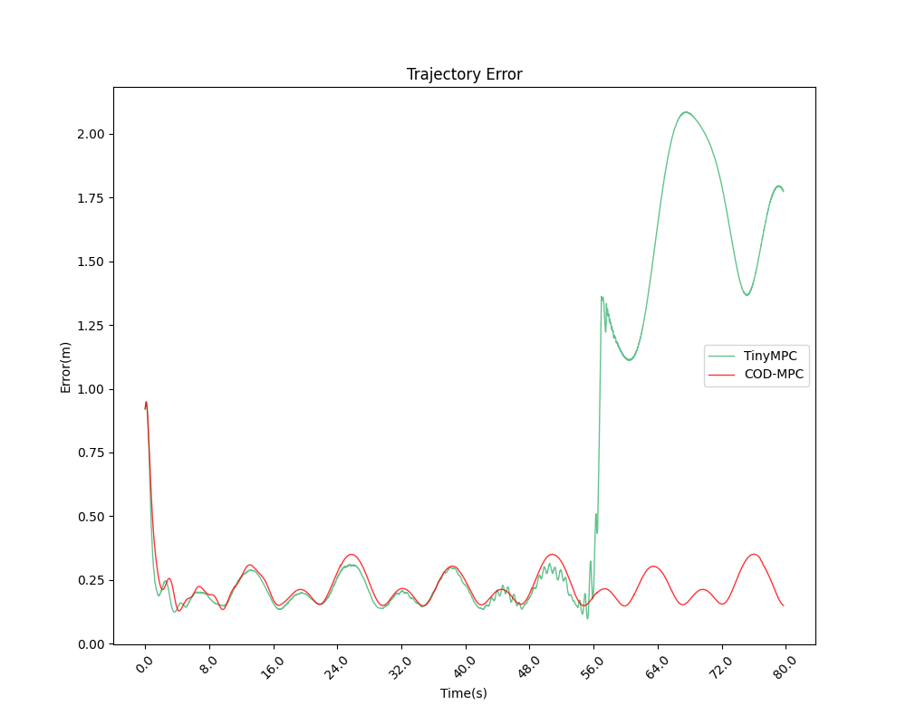

# 无人机实验报告
20250808

## 问题发现
实验中发现，tinympc大约会在40s之后发生抖动，然后乱飞

见以下图片

### 只沿倾斜30°


### 沿x,y 都倾斜30°





## 出现此问题的原因
### 直接原因：

接收位姿话题（`/reed_quad_x/odometry_sensor1/odometry`）的队列 在刚开始发生抖动前一点的时间会**满**，导致tinympc没有使用最新的状态量x进行计算，导致求出来的控制量u会偏大（尤其是$\tau_x$会比前面正常飞时大），导致了姿态角$\phi$的变化比较大，从而出现了抖动

### 根本原因：

经过排查，队列会满的根本原因是:ROS端的主要控制代码的这两行没有注释掉，导致电机转速话题的频率只有约90Hz(低于100Hz)，而位姿话题的频率是稳定的100Hz。这就导致入队比出队更快，从而使得队列满了。

```python
rospy.loginfo(f"PC Execution time: {execution_time:.2f} μs")  # 原本没有注释
rospy.loginfo(f"ARM Execution time: {running_time:.2f} μs")   # 原本没有注释
```

注：为什么我一开始没有注释这两行？

因为电机转速话题的发布（下面这行代码），是在PC端的计时范围内的。
```python
# 发布控制命令：电机转速
self.publish_cmd(motor_speeds)
```
而PC端的时间没有超过10ms，导致我以为 **电机转速话题的发布**以及**gazebo对电机转速话题的响应** 也是在这10ms内完成的，但事实发现并非如此。

### 解决方法
注释掉了这两行，电机转速话题的频率能稳定在100Hz左右，最低也只是99点几Hz
```python
# rospy.loginfo(f"PC Execution time: {execution_time:.2f} μs")  # 原本没有注释
# rospy.loginfo(f"ARM Execution time: {running_time:.2f} μs")   # 原本没有注释
```

附：修改后ROS端的主要控制代码见下方：
```python
# MPC main 
def control_loop(self):
    '''
    控制主循环, 分为2个阶段:
        1.准备阶段: 不飞 (为了便于在仿真中观察无人机刚起飞时的现象)
        2.飞行阶段: 按照预定轨迹飞行。
            有2种方法:
            2.1 利用tinympc求解问题
            2.2 利用FPGA求解问题
    '''
    try:
        rospy.loginfo("=======MPC control loop started.=========")
        count = 0
        sp_obj = sp.SerialPortNode()
        self.odometry_subscriber=rospy.Subscriber('/reed_quad_x/odometry_sensor1/odometry',Odometry,self.odometry_callback ,queue_size=1)
        while True:
            msg = self.odom_queue.get()
            start_time = time.perf_counter()
            count += 1
            # 解析消息，更新状态
            (roll, pitch, yaw) = euler_from_quaternion([
                msg.pose.pose.orientation.x,
                msg.pose.pose.orientation.y,
                msg.pose.pose.orientation.z,
                msg.pose.pose.orientation.w
            ], axes='sxyz')
            self.state = np.array([
                msg.pose.pose.position.x, msg.pose.pose.position.y, msg.pose.pose.position.z,
                msg.twist.twist.linear.x, msg.twist.twist.linear.y, msg.twist.twist.linear.z,
                roll, pitch, yaw,
                msg.twist.twist.angular.x, msg.twist.twist.angular.y, msg.twist.twist.angular.z
            ])
            #rospy.loginfo(f"count : {count}, State: {self.state}")
            # 位置更新
            self.xk[:,0]=self.state
            # 开始计时
            # 求解问题
            sp_obj.send_floats(self.traj_idx, self.state)
            self.traj_idx += 1
            self.controlVector, status = sp_obj.receive_floats()
            if status != 0:
                rospy.logerr(f"Error receiving control vector: {status}")
                continue
            # 结束计时
            #rospy.loginfo(f"count : {count}, control: {self.controlVector}")
            
            # 利用FPGA求解问题，得到4个控制量
            thrust, torque_x, torque_y, torque_z, running_time = self.controlVector
            
            # 利用 PC上的求解器 求解问题
            # thrust, torque_x, torque_y, torque_z=self.LQR_solve(self.idx)
            # thrust, torque_x, torque_y, torque_z=self.Tinympc_solve(self.idx)
            
            #rospy.loginfo(f'Thrust: {thrust:.2f}, Torques: ({torque_x:.2f}, {torque_y:.2f}, {torque_z:.2f})')
            # 把推力转换为转速
            motor_speeds = self.thrust_to_motor_speeds(thrust, torque_x, torque_y, torque_z)
            motor_speeds=np.array(motor_speeds)
            
            # 发布控制命令：电机转速
            self.publish_cmd(motor_speeds)

            #rospy.loginfo(f"x0:{self.xk[:,0]}")
            if count < TRAJ_SAMPLE_NUM - self.N - 1:
                self.xk_history.append(self.state)
                self.uk_history.append(self.controlVector)
            elif count == TRAJ_SAMPLE_NUM - self.N - 1:
                rospy.loginfo("data collection finished, saving to csv...")
                df_xk_history = pd.DataFrame(self.xk_history, columns=['px', 'py', 'pz', 'vx', 'vy', 'vz', 'roll', 'pitch', 'yaw', 'wx', 'wy', 'wz'])
                df_uk_history = pd.DataFrame(self.uk_history, columns=['thrust', 'tau_x', 'tau_y', 'tau_z', 'arm_time'])
                df_xk_history.to_csv(FILE_ROOT+'xk_history.csv', index=False)
                df_uk_history.to_csv(FILE_ROOT+'uk_history.csv', index=False)
                
            end_time = time.perf_counter()
            execution_time = (end_time - start_time) * 1000000  # 转换为微秒
            # rospy.loginfo(f"PC Execution time: {execution_time:.2f} μs")  # 原本没有注释
            # rospy.loginfo(f"ARM Execution time: {running_time:.2f} μs")   # 原本没有注释
    except queue.Empty:
        pass
```

## 重新测量后的结果

### 飞行于2m


轨迹误差（单位：米）
|solver| mean | max |
|---|---|---|
|TinyMPC|0.215368|0.417517|
|COD-MPC|0.213171|0.418830|


求解时间（单位：微秒）
|solver| mean | max |
|---|---|---|
|TinyMPC|2429.235530|4837.460938|
|COD-MPC|907.007263|920.259216|

(文件夹：tinympc_uart_100Hz_time_vary_2m_2，CODMPC_uart_100Hz_time_vary_2m)

### 飞行于 0.5m


轨迹误差（单位：米）
|solver| mean | max |
|---|---|---|
|TinyMPC|0.205621|0.455427|
|COD-MPC|0.213188|0.490060|


求解时间（单位：微秒）
|solver| mean | max |
|---|---|---|
|TinyMPC|2401.052741|4835.918945|
|COD-MPC|904.748750|919.779175|


(文件夹：tinympc_uart_100Hz_time_vary_50cm，CODMPC_uart_100Hz_time_vary_50cm_3)

### 只沿y轴倾斜30°


轨迹误差（单位：米）
|solver| mean | max |
|---|---|---|
|TinyMPC|0.212488|0.438783|
|COD-MPC| 0.214873|0.438455|


求解时间（单位：微秒）
|solver| mean | max |
|---|---|---|
|TinyMPC|2584.501181|6295.121582|
|COD-MPC|904.703286|919.989197|


(文件夹：tinympc_uart_100Hz_time_vary_y30dg_5， CODMPC_uart_100Hz_time_vary_y30dg_2)


### 沿x,y 都倾斜30°


轨迹误差（单位：米）
|solver| mean | max |
|---|---|---|
|TinyMPC| 0.227947| 0.948328|
|COD-MPC| 0.228441|0.948065|


求解时间（单位：微秒）
|solver| mean | max |
|---|---|---|
|TinyMPC|2637.460911|6790.526855|
|COD-MPC|904.759855|919.059204|


(文件夹: tinympc_uart_100Hz_time_vary_y30dg_x30dg_5, CODMPC_uart_100Hz_time_vary_y30dg_x30dg_2)

## 总结
在轨迹误差上，TinyMPC与COD-MPC其实差不多；
但是在求解时间方面，COD-MPC 的求解时间远远小于 TinyMPC。
而且，轨迹越复杂，TinyMPC所需要的求解时间更长，而 COD-MPC 的求解时间却能够一直稳定在900us左右