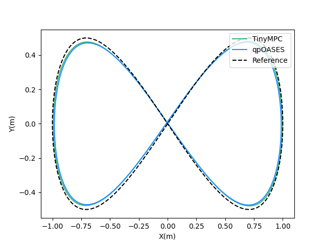
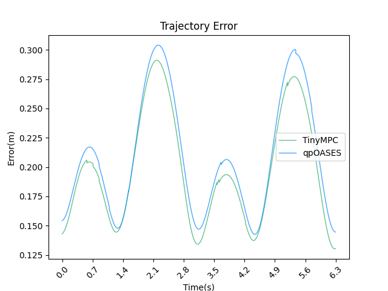

# 无人机实验报告
## 实验目的
以无人机为实验平台，采用MPC控制器，比较不同求解器之间的求解速度、求解精度等性能。

## 实验方法
MPC控制策略是一种最优化控制策略，需要对一个二次规划（QP）问题进行求解，其中涉及大量矩阵乘法和矩阵求逆的运算。通过利用不同求解器以MPC控制策略来控制无人机，然后比较无人机的轨迹误差，可以比较不同求解器的性能。

## 实验结果与分析
无人机的控制频率为100Hz。MPC控制中，取预测补长为20。利用 qpOASES、TinyMPC、CODMPC三种求解器的飞行轨迹如下。
### 轨迹比较
无人机在不同求解器下的轨迹及其误差如下图所示：

### 轨迹误差比较

最后1圈的轨迹误差（单位：米）
|Solver name|xy方向的RMSE |xyz方向的RMSE | xyz方向的平均误差| xyz方向的最大误差|
|---|---|---|---|---|
|qpOASES|0.2133|0.2151|0.209194|0.304025|
|TinyMPC|0.2030|0.2031| 0.197539|0.291091|
|CODMPC|**pending**|**pending**|**pending**|**pending**|

由图片和表格可见，qpOASES和TinyMPC的轨迹误差相近
（todo:在图中加入我们求解器的数据，加入我们求解器的描述）
### 产生此实验结果的原因

## 实验结论

