# 无人机实验报告
20250806~20250807
## 实验目的
以无人机为实验平台，采用MPC控制器，比较不同求解器之间的求解速度、求解精度等性能。

## 实验方法
MPC控制策略是一种最优化控制策略，需要对一个二次规划（QP）问题进行求解，其中涉及大量矩阵乘法和矩阵求逆的运算。通过利用不同求解器以MPC控制策略求解**时变**问题来控制无人机，然后比较无人机的轨迹误差，可以比较不同求解器的性能。

## 实验结果与分析
无人机的控制频率为100Hz。MPC控制中，取预测补长为20。利用 qpOASES、TinyMPC、CODMPC三种求解器的飞行轨迹如下。

### 轨迹比较
在100Hz的控制频率下，使用qpOASES求解时变问题，单次求解需要约73ms,无法在10ms内求解完成,导致无人机无法正常飞行。如下图所示：

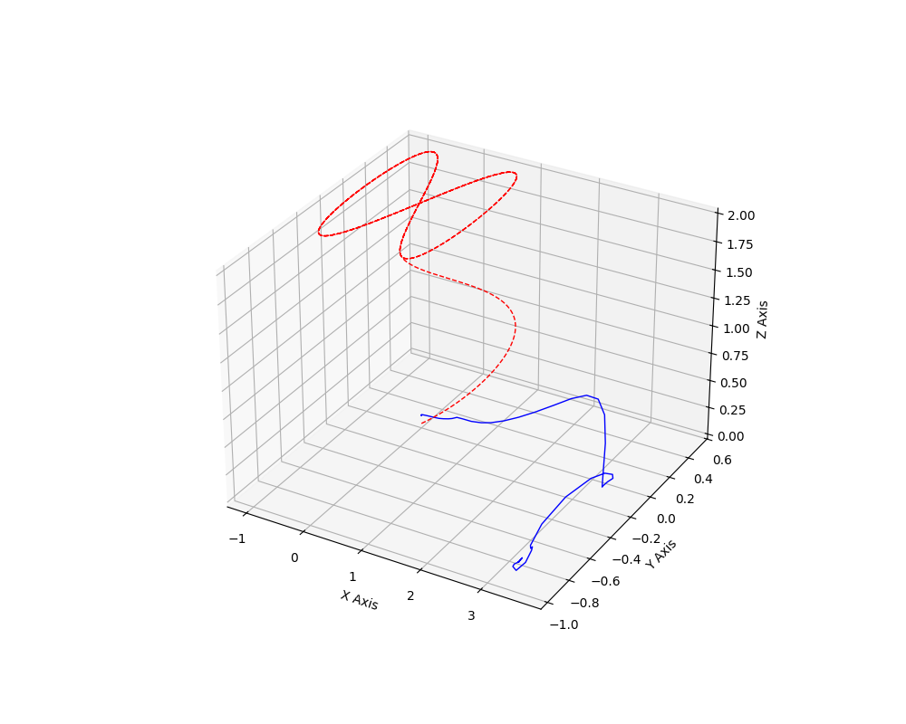


无人机在不同求解器下的轨迹及其误差如下图所示：
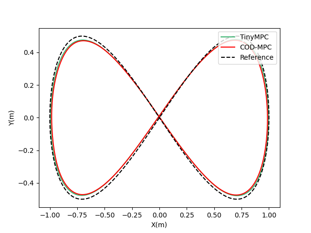

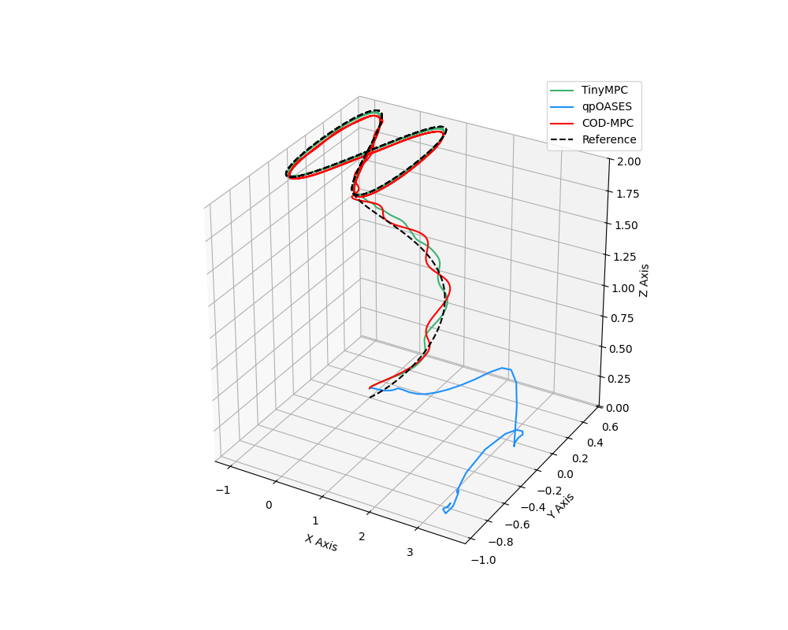

### 轨迹误差比较
xyz方向的轨迹误差
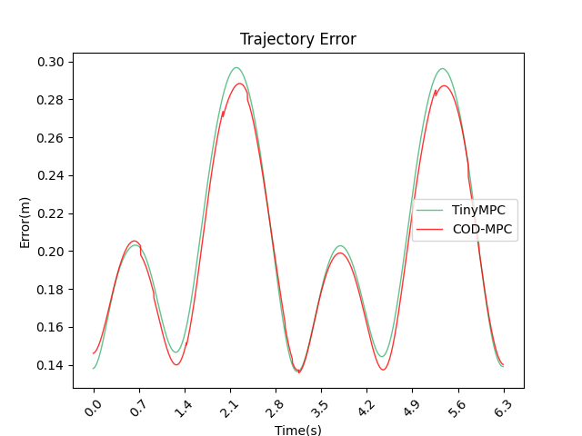

轨迹误差
|Solver name|xy方向的RMSE（米） |xyz方向的RMSE（米） | xyz方向的平均误差（米）| xyz方向的最大误差（米）|
|---|---|---|---|---|
|TinyMPC| 0.2097| 0.2099 |0.2038| 0.2967|
|COD-MPC| 0.2037| 0.2056|0.1999| 0.2884 |

(RMSE是Root Mean Square Error的缩写，其数学公式为：
$$
RMSE =\sqrt{ \frac{1}{n}\sum_{i=1}^{n}(y_i - \hat{y}_i)^2 }
$$)
由图片和表格可见，COD-MPC的轨迹误差比TinyMPC更小，说明COD-MPC求解器的求解精度更高


### 求解时间的比较
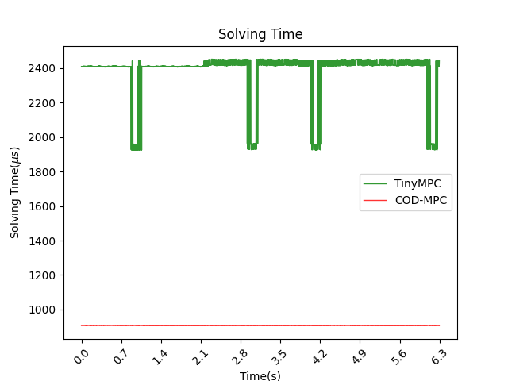

求解时间
|Solver name|平均求解时间（微秒）|最大求解时间（微秒）|
|---|---|---|
|TinyMPC|2382.4723|2453.294922 |
|COD-MPC|906.8023|908.739136|

由图片和表格可见，COD-MPC的求解时间远小于TinyMPC的求解时间。
注意：此结果是TinyMPC使用了o2优化之后测得的。如果二者都**不开优化(o0)**，TinyMPC单次求解需要约**11ms**,无法在10ms内求解完成,导致无人机无法正常飞行（如下图所示），而COD-MPC单次求解只需要**1.5ms**。这说明COD-MPC求解器比TinyMPC的求解时间提高了**10倍**

TinyMPC 不开优化的效果
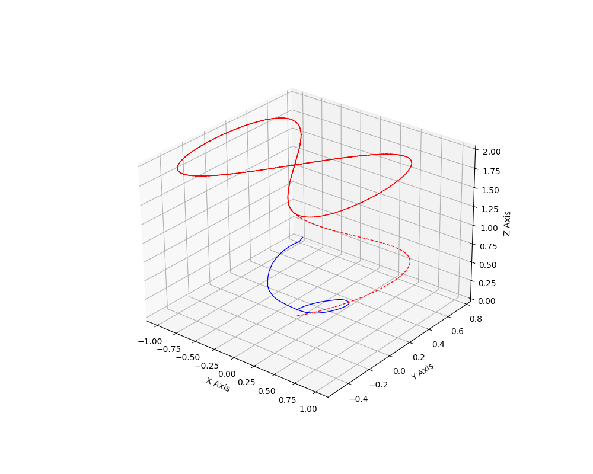


### 产生此实验结果的原因
COD-MPC求解器的求解时间比TinyMPC更短，因此COD-MPC求解器可以在更短时间内求解完相同规模的问题，获得更优的解，从而在无人机飞行中体现出更高的控制精度


## 实验结论
根据此实验的数据可以得出，COD-MPC求解器无论是在求解精度还是求解时间上都比 TinyMPC、qpOASES更有优势。


# 补充
## 全部轨迹，飞行于2m

轨迹方程如下：
```python
# ====== 参数配置 ======
duration = 40.0         # 总时长（秒）
time_step = 0.005         # 时间步长（秒）
radius = 1            # 8字形半径（米）
target_height = 2    # 目标飞行高度（米）
climb_time = 5.0        # 爬升到目标高度的时间（秒）
omega = 0.5             # 角速度（控制轨迹速度）

# ====== 生成时间序列 ======
t = np.arange(0, duration, time_step)

# ====== 轨迹方程 ======
# --- 水平方向（X-Y平面） ---
x = radius * np.sin(omega * t)               # X轴
y = 0.5 * radius * np.sin(2 * omega * t)     # Y轴

# --- 垂直方向（Z轴） ---
z = np.zeros_like(t)                         # 初始高度为0

# 爬升阶段（使用平滑的余弦过渡）
climb_mask = t <= climb_time
z[climb_mask] = target_height * (1 - np.cos(np.pi * t[climb_mask] / climb_time)) / 2

# 平飞阶段（保持目标高度）
z[~climb_mask] = target_height
```


截短qpOASES
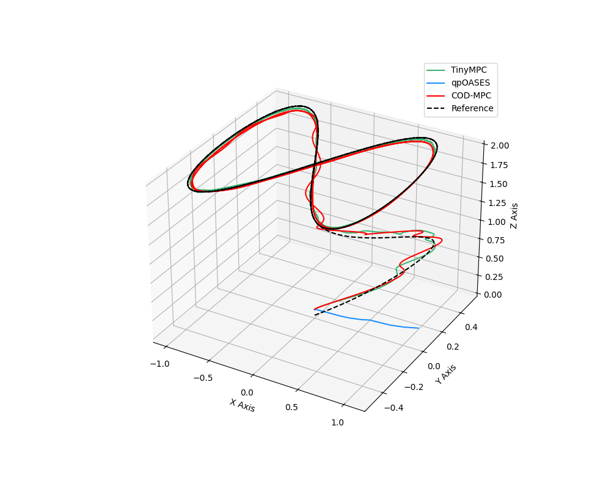

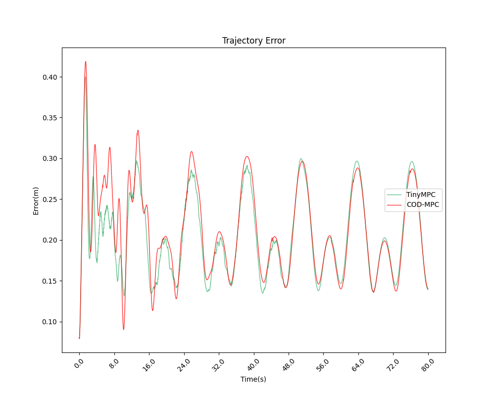
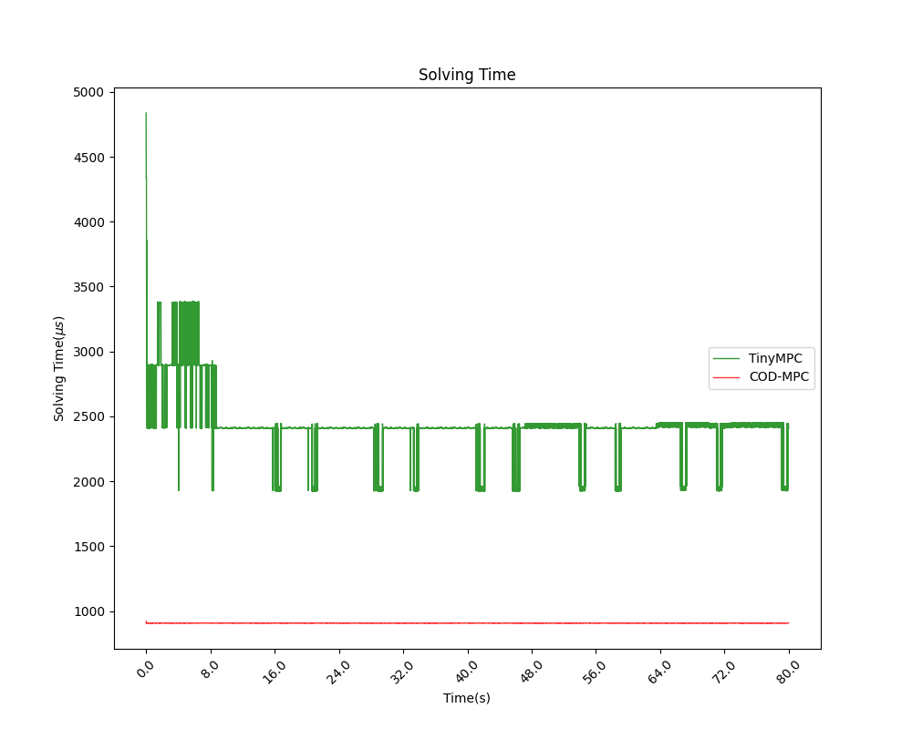


===========Trajectory Error============

TinyMPC
                px           py           pz    magnitude

count  7972.000000  7972.000000  7972.000000  7972.000000

mean     -0.008918    -0.006511    -0.017353     0.205004

std       0.151719     0.140621     0.038752     0.051826

min      -0.293568    -0.272666    -0.165424     0.079195

25%      -0.156695    -0.143820    -0.008225     0.161169

50%      -0.015964    -0.012998    -0.006673     0.195310

75%       0.141830     0.132769    -0.004724     0.247262

max       0.222695     0.202674     0.080029     0.400177


COD-MPC
                px           py           pz    magnitude

count  7972.000000  7972.000000  7972.000000  7972.000000

mean     -0.009519    -0.006004    -0.039540     0.213171

std       0.156098     0.144178     0.042452     0.056558

min      -0.308313    -0.283868    -0.200019     0.079193

25%      -0.160044    -0.145620    -0.028976     0.166732

50%      -0.017205    -0.015726    -0.027902     0.201517

75%       0.144462     0.134429    -0.027131     0.260815

max       0.267291     0.244179     0.080029     0.418830


===========Solving Time============

TinyMPC

count    7972.000000

mean     2439.863311

std       249.471282

min      1923.317871

25%      2409.344238

50%      2411.492920

75%      2419.553833

max      4837.655762

COD-MPC

count    7972.000000

mean      907.007263

std         0.597866

min       905.319031

25%       906.579102

50%       906.999023

75%       907.419067

max       920.259216

## 全部轨迹，飞行于0.5m

轨迹方程如下：
```python
# ====== 参数配置 ======
duration = 40.0         # 总时长（秒）
time_step = 0.005         # 时间步长（秒）
radius = 1            # 8字形半径（米）
target_height = 0.5    # 目标飞行高度（米）
climb_time = 5.0        # 爬升到目标高度的时间（秒）
omega = 0.5             # 角速度（控制轨迹速度）

# ====== 生成时间序列 ======
t = np.arange(0, duration, time_step)

# ====== 轨迹方程 ======
# --- 水平方向（X-Y平面） ---
x = radius * np.sin(omega * t)               # X轴
y = 0.5 * radius * np.sin(2 * omega * t)     # Y轴

# --- 垂直方向（Z轴） ---
z = np.zeros_like(t)                         # 初始高度为0

# 爬升阶段（使用平滑的余弦过渡）
climb_mask = t <= climb_time
z[climb_mask] = target_height * (1 - np.cos(np.pi * t[climb_mask] / climb_time)) / 2

# 平飞阶段（保持目标高度）
z[~climb_mask] = target_height
```

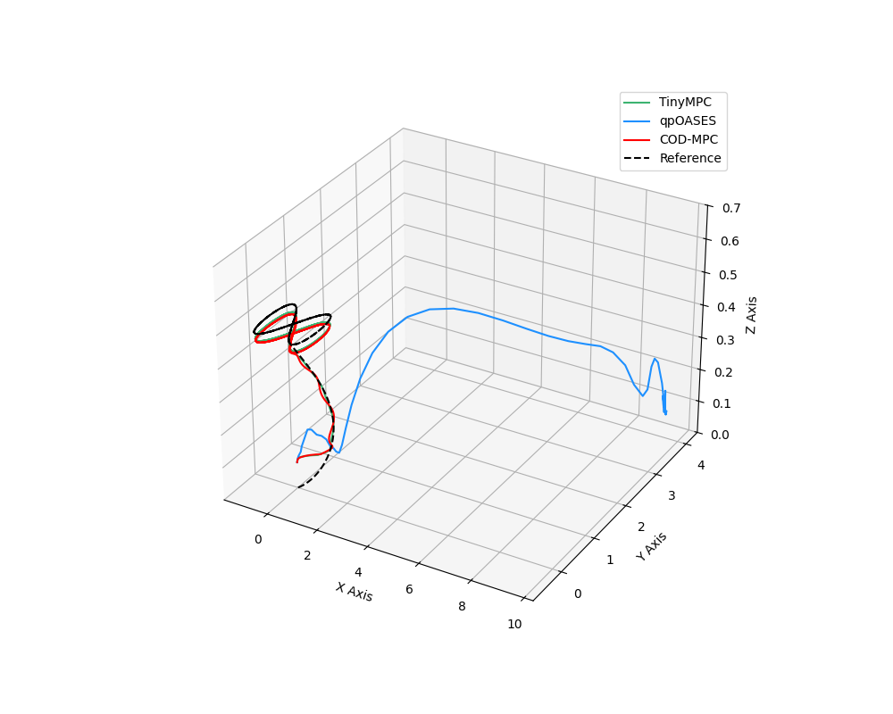

截短qpOASES
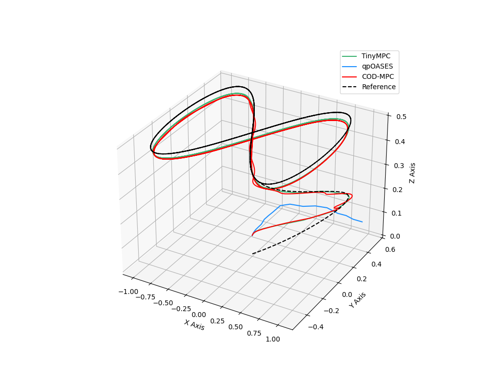

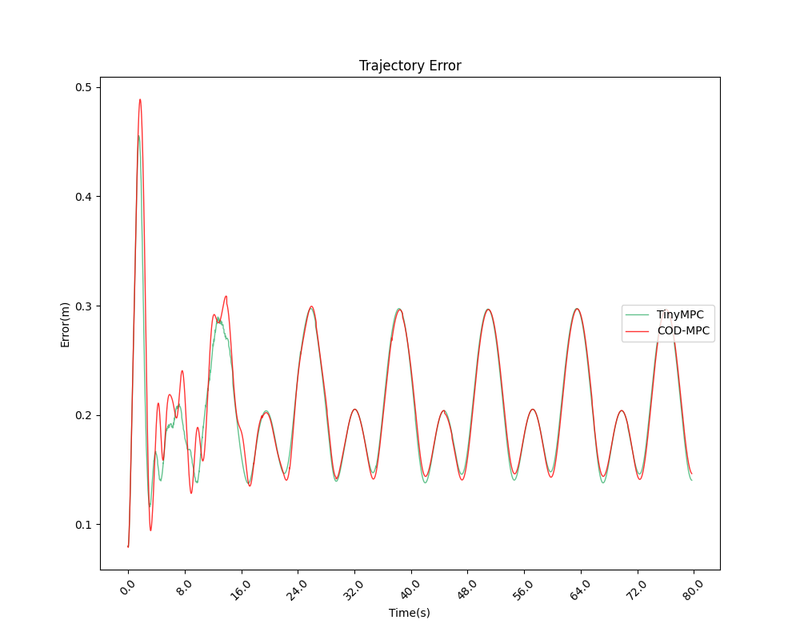

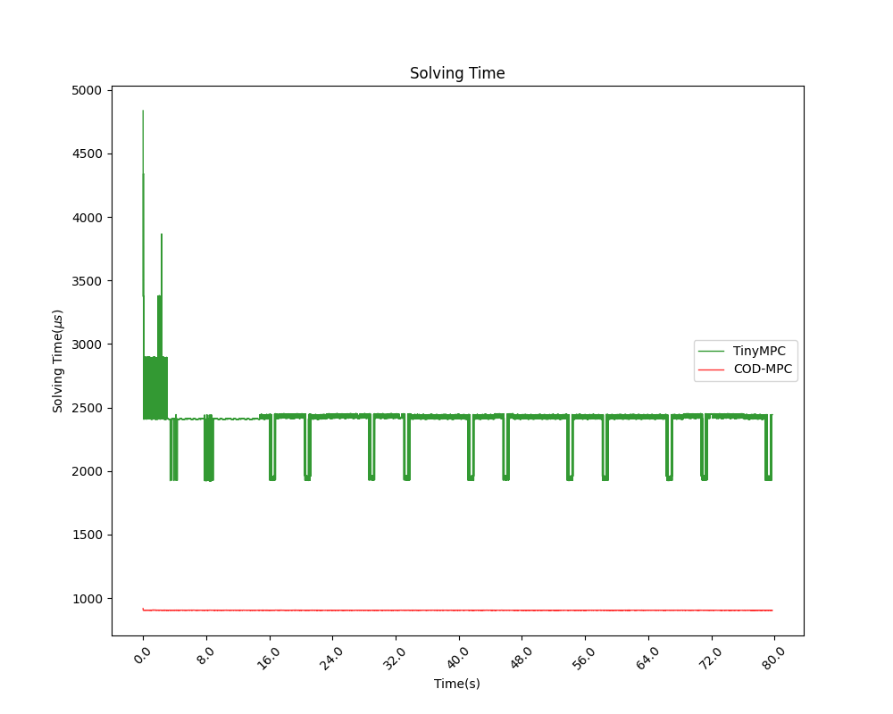

===========Trajectory Error============

TinyMPC

                px           py           pz    magnitude

count  7972.000000  7972.000000  7972.000000  7972.000000

mean     -0.009991    -0.006279    -0.022482     0.205621

std       0.154007     0.143938     0.017698     0.055760

min      -0.333468    -0.304044    -0.064666     0.079820

25%      -0.157210    -0.146788    -0.023577     0.160591

50%      -0.016402    -0.008099    -0.022712     0.193473

75%       0.143591     0.136847    -0.022057     0.247566

max       0.214053     0.203947     0.080024     0.455427

COD-MPC

                px           py           pz    magnitude

count  7972.000000  7972.000000  7972.000000  7972.000000

mean     -0.010511    -0.006972    -0.027558     0.208874

std       0.156714     0.145989     0.018877     0.059273

min      -0.361221    -0.325685    -0.075048     0.079120

25%      -0.161899    -0.148318    -0.028771     0.162756

50%      -0.020347    -0.006349    -0.027808     0.196869

75%       0.147383     0.137051    -0.027113     0.250787

max       0.237024     0.217052     0.080012     0.488903

===========Solving Time============

TinyMPC

count    7972.000000

mean     2401.052741

std       167.203511

min      1922.774902

25%      2410.178223

50%      2416.437012

75%      2443.791016

max      4835.918945

COD-MPC

count    7972.000000

mean      904.757096

std         0.579652

min       903.039001

25%       904.359070

50%       904.749023

75%       905.109070

max       918.219177


## 倾斜30°
轨迹方程如下：
```python
# ====== 参数配置 ======
duration = 40.0         # 总时长（秒）
time_step = 0.005         # 时间步长（秒）
radius = 1            # 8字形半径（米）
target_height = 0.5    # 目标飞行高度（米）
climb_time = 5.0        # 爬升到目标高度的时间（秒）
omega = 0.5             # 角速度（控制轨迹速度）

# ====== 生成时间序列 ======
t = np.arange(0, duration, time_step)

# ====== 轨迹方程 ======
# --- 水平方向（X-Y平面） ---
x = radius * np.sin(omega * t)               # X轴
y = 0.5 * radius * np.sin(2 * omega * t)     # Y轴

# 倾斜30度
z = target_height+ y*np.tan(np.pi/6)
```

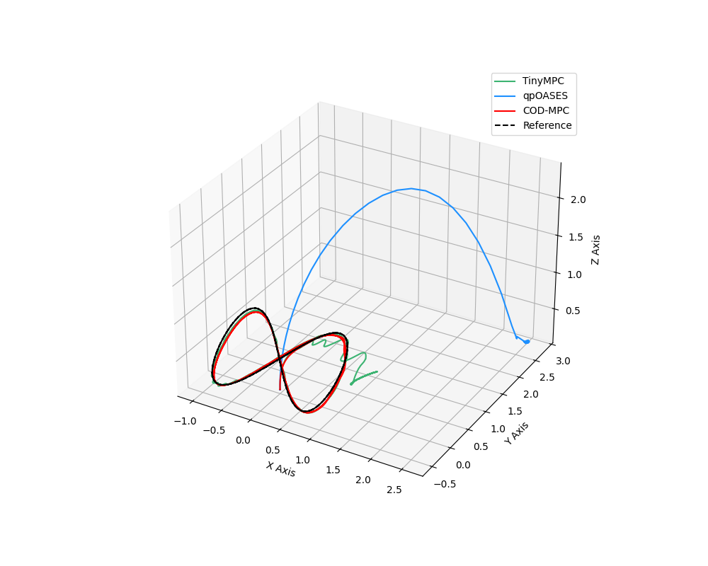

截短qpOASES


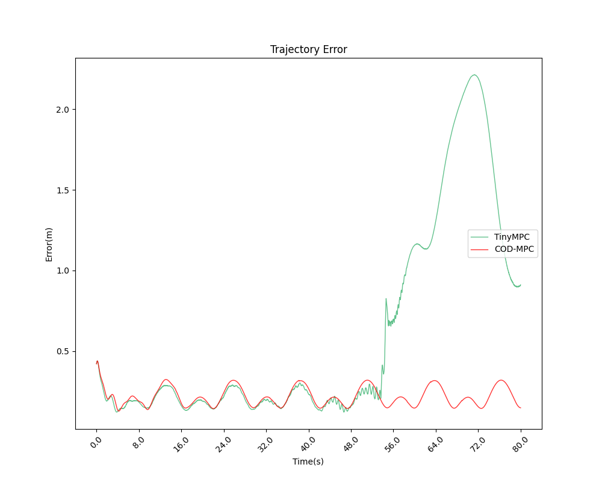

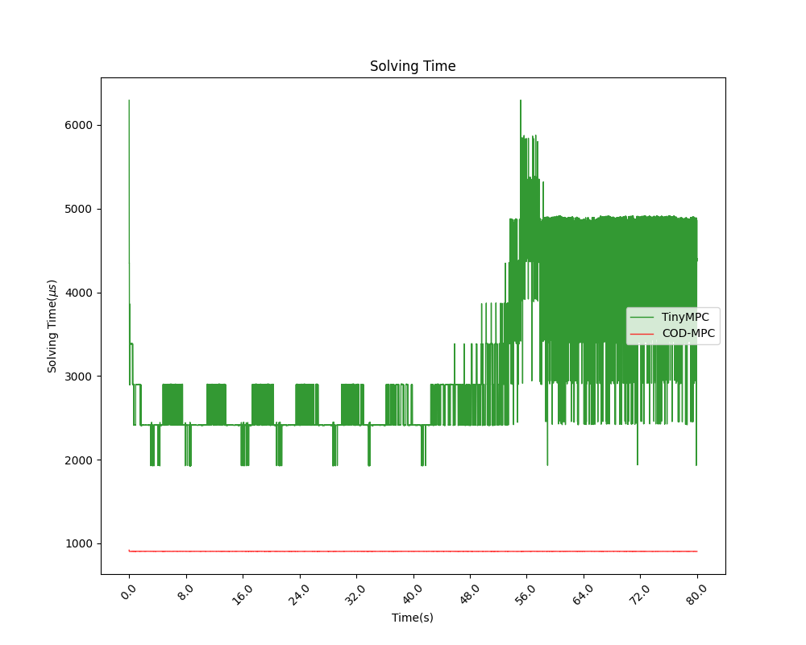


===========Trajectory Error============

TinyMPC

                px           py           pz    magnitude

count  7972.000000  7972.000000  7972.000000  7972.000000

mean      0.272672     0.254665    -0.153839     0.590524

std       0.590422     0.434574     0.218212     0.631822

min      -0.203102    -0.208856    -0.700006     0.120429

25%      -0.121297    -0.084575    -0.223214     0.175472

50%       0.071865     0.124485    -0.077770     0.239932

75%       0.198571     0.506816     0.004057     0.957902

max       1.890188     1.405338     0.055610     2.215047


COD-MPC

                px           py           pz    magnitude

count  7972.000000  7972.000000  7972.000000  7972.000000

mean     -0.008680    -0.004308    -0.032951     0.216963

std       0.155396     0.144806     0.065588     0.059326

min      -0.221015    -0.206929    -0.434938     0.126829

25%      -0.164094    -0.145555    -0.085056     0.167228

50%      -0.014475    -0.013180    -0.030785     0.204614

75%       0.147082     0.139675     0.025298     0.265281

max       0.224809     0.214993     0.050019     0.438324

===========Solving Time============
TinyMPC

count    7972.000000

mean     3182.087536

std       941.002688

min      1924.598999

25%      2413.892090

50%      2897.236328

75%      3881.758301

max      6298.526855

COD-MPC

count    7972.000000

mean      904.687006

std         0.566552

min       903.039001

25%       904.299011

50%       904.659058

75%       905.049011

max       918.729187

## 沿x,y方向都倾斜30°

轨迹方程如下：
```python
# ====== 参数配置 ======
duration = 40.0         # 总时长（秒）
time_step = 0.005         # 时间步长（秒）
radius = 1            # 8字形半径（米）
target_height = 1    # 目标飞行高度（米）
climb_time = 5.0        # 爬升到目标高度的时间（秒）
omega = 0.5             # 角速度（控制轨迹速度）

# ====== 生成时间序列 ======
t = np.arange(0, duration, time_step)

# ====== 轨迹方程 ======
# --- 水平方向（X-Y平面） ---
x = radius * np.sin(omega * t)               # X轴
y = 0.5 * radius * np.sin(2 * omega * t)     # Y轴
z = target_height+ y*np.tan(np.pi/6) + x*np.tan(np.pi/6) # z轴
```


截短qpOASES
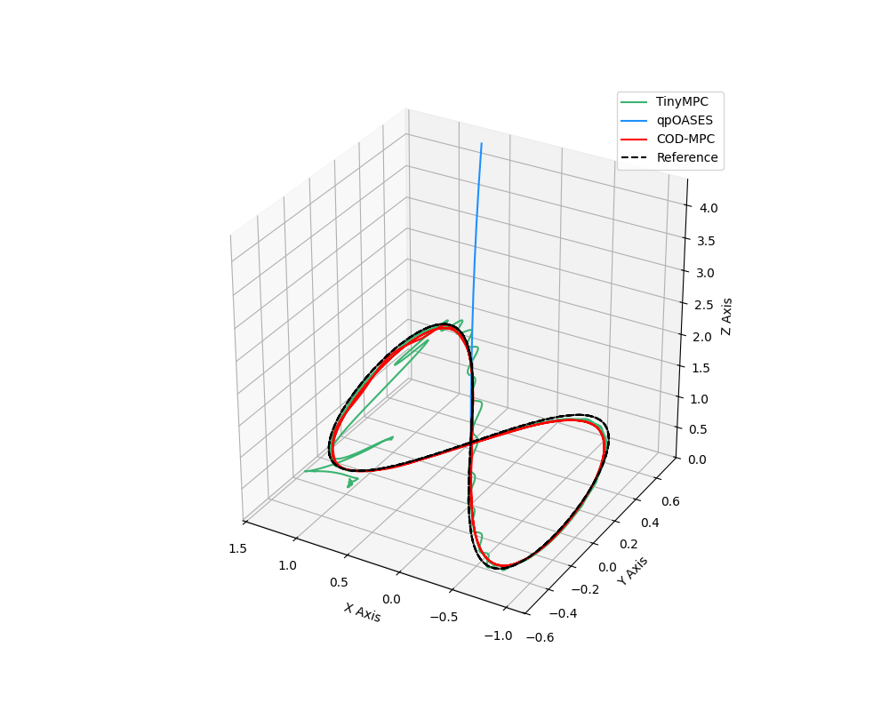

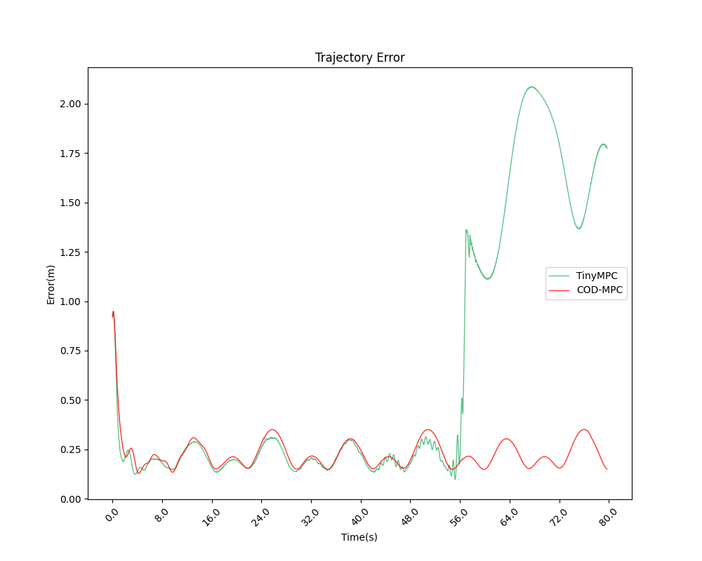

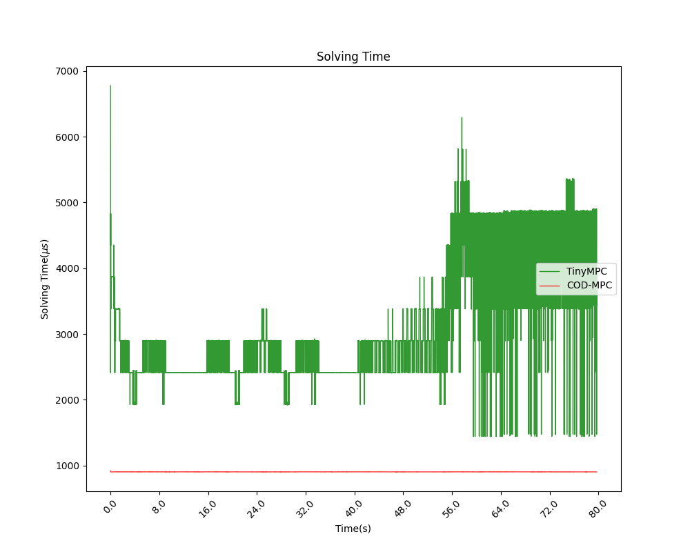

===========Trajectory Error============

TinyMPC

                px           py           pz    magnitude

count  7972.000000  7972.000000  7972.000000  7972.000000

mean      0.310019    -0.040479    -0.271408     0.618207

std       0.628007     0.237264     0.443490     0.660739

min      -0.199106    -0.669173    -1.672385     0.096692

25%      -0.112219    -0.157609    -0.360184     0.174271

50%       0.088766    -0.016008    -0.069463     0.235398

75%       0.230419     0.149490     0.022679     1.184036

max       2.004752     0.431436     0.067716     2.084341

COD-MPC

                px           py           pz    magnitude

count  7972.000000  7972.000000  7972.000000  7972.000000

mean     -0.007930    -0.004096    -0.040532     0.228251

std       0.155184     0.144696     0.112719     0.085687

min      -0.220007    -0.209643    -0.947478     0.128479

25%      -0.162086    -0.144587    -0.098483     0.172793

50%      -0.013293    -0.013051    -0.013897     0.208063

75%       0.146613     0.139335     0.036732     0.270736

max       0.227158     0.218133     0.060094     0.948591

===========Solving Time============

TinyMPC

count    7972.000000

mean     3190.279992

std       925.159587

min      1439.285889

25%      2413.847168

50%      2897.852783

75%      3863.492065

max      6777.002930

COD-MPC

count    7972.000000

mean      904.747704

std         0.557968

min       902.979065

25%       904.359070

50%       904.719055

75%       905.079041

max       920.049194

# 汇总
轨迹误差(单位：米)
| solver | 2m | 0.5m | 倾斜30°| x,y都倾斜30° |
|---|---|---|---|---|
| qpOASES |fail|fail|fail|fail|
| TinyMPC |mean: 0.205004, max: 0.400177|mean: 0.205621, max:0.455427|mean: 0.590524, max: 2.215047|mean: 0.618207, max: 2.084341|
| COD-MPC |mean: 0.213171, max: 0.418830|mean: 0.208874, max:0.488903|mean: 0.216963, max: 0.438324|mean: 0.228251, max: 0.948591|


求解时间(单位：微秒)
| solver | 2m | 0.5m | 倾斜30°| x,y都倾斜30° |
|---|---|---|---|---|
| qpOASES |fail|fail|fail|fail|
| TinyMPC |mean: 2439.863311, max: 4837.655762|mean: 2401.052741, max: 4835.918945|mean: 3182.087536, max: 6298.526855|mean: 3190.279992, max: 6777.002930|
| COD-MPC |mean: 907.007263, max: 920.259216|mean: 904.757096, max:918.219177|mean: 904.687006, max: 918.729187|mean: 904.747704, max: 920.049194|


