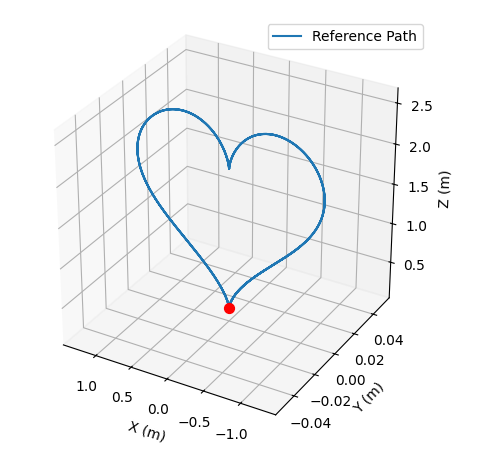
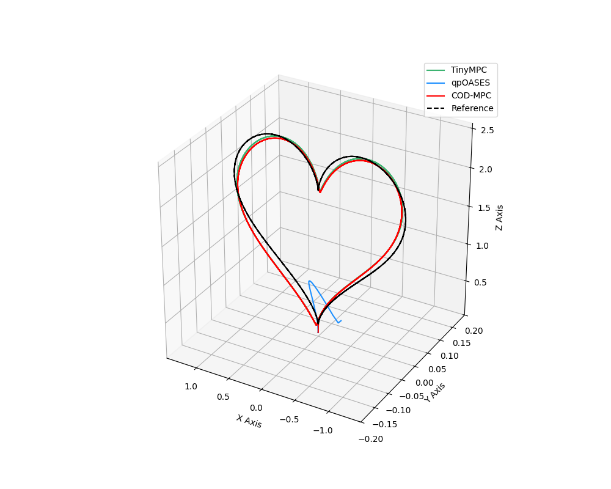
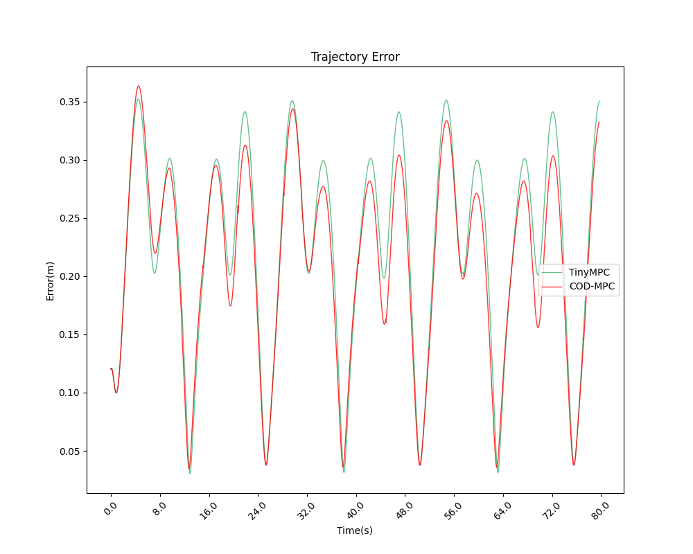
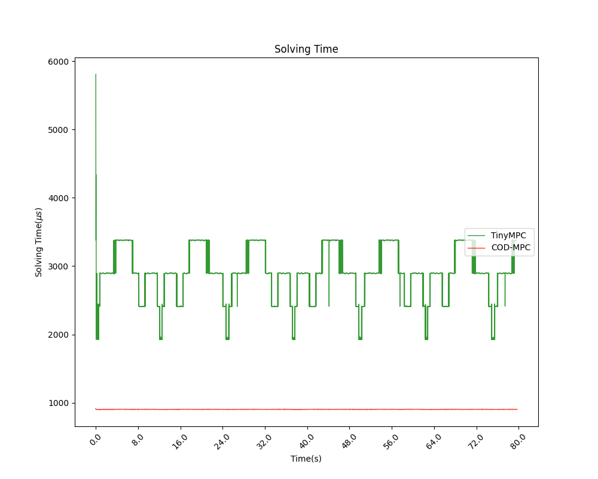
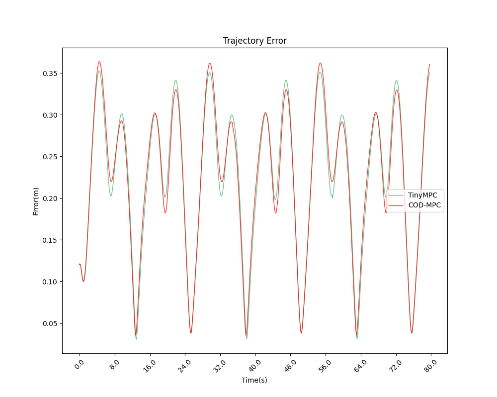

# 无人机实验报告
20250809

## x-z 平面上的心形
轨迹方程：
```python
# ====== 参数配置 ======
duration = 40.0         # 总时长（秒）
time_step = 0.005         # 时间步长（秒）

omega = 0.5             # 角速度（控制轨迹速度）
x0 ,y0, z0 =0,0,0 # 起点
s = 0.08  # 缩放因子

# ====== 生成时间序列 ======
t = np.arange(0, duration, time_step)

# ====== 轨迹方程 ======
theta = omega*t - np.pi

x_center, z_center = 0 + x0,  17*s + z0 +0.2  # 中心点坐标 （稍微高一点，避免撞地）

# x-z平面上的爱心方程
x=x_center + s*(16*(np.sin(theta))**3)
z=z_center + s*(13*np.cos(theta) - 5*np.cos(2*theta) - 2*np.cos(3*theta) -np.cos(4*theta))
y=np.zeros_like(t)

vx = np.zeros_like(t)
vy = np.zeros_like(t)
vz = np.zeros_like(t)

# ====== 姿态与角速度 ======
# 假设无人机始终朝向速度方向（简化处理）
yaw = np.zeros_like(t)                     # 偏航角（基于水平速度方向）

# Roll/Pitch 保持水平（设为0）
roll = np.zeros_like(t)
pitch = np.zeros_like(t)

# 角速度（姿态导数）
p = np.zeros_like(t)                         # Roll角速度
q = np.zeros_like(t)                         # Pitch角速度
r = np.zeros_like(t)                         # Yaw角速度

# ====== 组合状态量 ======
# 状态量顺序：[x, y, z, vx, vy, vz, roll, pitch, yaw, p, q, r]
states = np.vstack([x, y, z, vx, vy, vz, roll, pitch, yaw, p, q, r]).T
```

如下图：


该轨迹的特点：
**有尖有圆**，线条的弧度变化多样。

相比之下，8字型轨迹只有圆的，没有尖的。

所以，个人认为心形轨迹比较有**普遍性**






轨迹误差（单位：米）
|solver| mean | max |
|---|---|---|
|TinyMPC| 0.223913| 0.352272|
|COD-MPC| 0.211737| 0.363448|



求解时间（单位：微秒）
|solver| mean | max |
|---|---|---|
|TinyMPC|2906.514858|5808.302734|
|COD-MPC|904.512443|916.569153|

(文件夹: tinympc_uart_100Hz_time_vary_heart_xz, CODMPC_uart_100Hz_time_vary_heart_xz_2)

## 出现此结果的原因
以上的轨迹误差中，可以看到：COD-MPC几乎在整个飞行过程中都略优于TinyMPC

但是含有**偶然**因素！

在另一次的求解中，有以下结果：


(文件夹: tinympc_uart_100Hz_time_vary_heart_xz, CODMPC_uart_100Hz_time_vary_heart_xz)


## 总结
由轨迹图可见，COD-MPC和TinyMPC的误差其实差不多，不只是误差的大小相近，而且偏离参考轨迹的方向也相近。所以，在实时控制中，只要时间足够，两种求解器的求解精度其实区别不大，导致他们的控制效果也差不多。

加之上面所讲的心形轨迹具有普遍性，因此再尝试其他高难度的轨迹意义不大，COD-MPC和TinyMPC的误差也会是差不多的。