# 实验记录
无人机参数:

m = 1.05kg
g = 9.81 m/s^2


轨迹：8字型轨迹

轨迹生成文件：`UAV_Trajectory/traj_8`


## 数值实验

### 纯python tinympc
20250720

**第一组**

```python
N = 30 #预测步长
Q = np.diag([100,100,100,0,0,0,0,0,100, 0,0,0])
R = np.diag([0.1,0.1,0.1,0.1])
```

使用这组Q，R最佳，效果如下图：

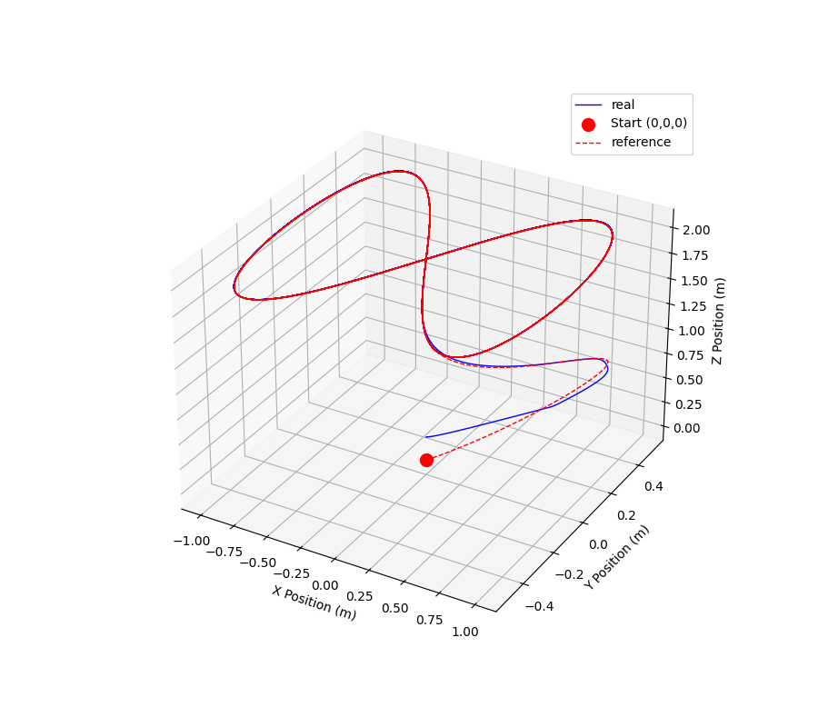

> [!CAUTION]
>
> 问题：
>
> 在刚开始的上升阶段，tinympc迭代次数为99次（规定的最大迭代次数），得到的解会超过无人机电机转速的限制！
>
> 但是上升之后的8字型轨迹，拟合得非常好。


**改进：**

缩小迭代次数，加强对 u 的限制

```python
N = 30 #预测步长
Q=np.diag([100,100,100,0,0,0,0,0,100, 0,0,0])
R = np.diag([0.1,0.1,0.1,0.1])

# 迭代次数限制为10
self.max_iter = 10 # 100

# 加强对 u 的限制
self.umax_vec = np.array([32,1.87,1.87,0.2079])
self.umin_vec = np.array([0,-1.87,-1.87,-0.2079])
```

以下是效果图

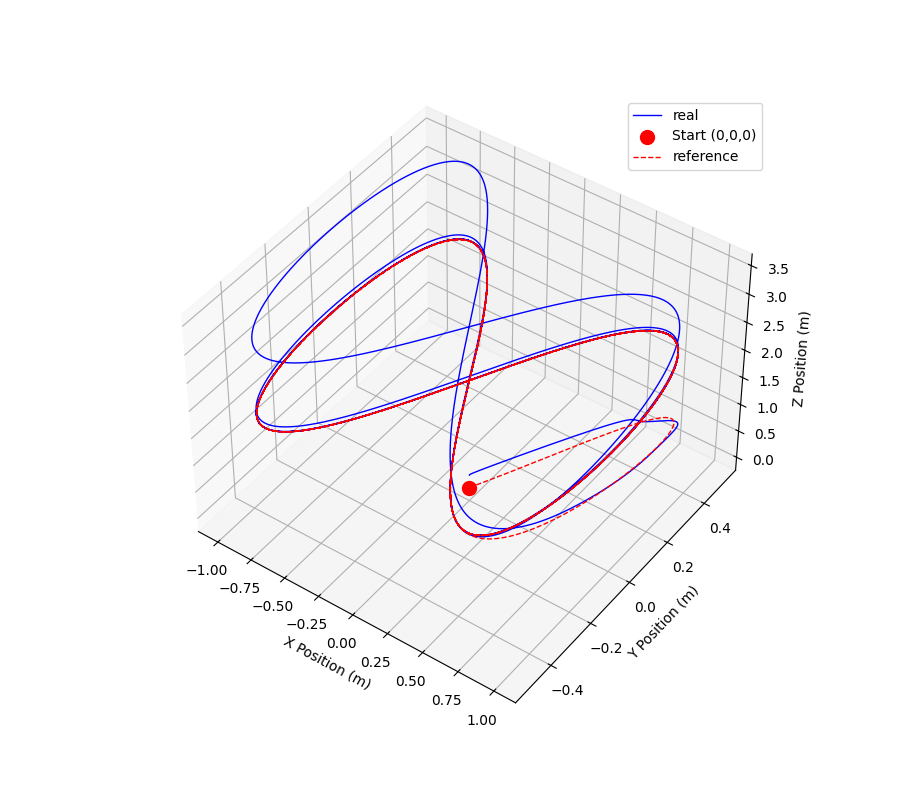


**第二组**

```python
N = 30 #预测步长
Q = np.diag([100,100,100,0,0,0,0,0,100, 0,0,0])
R = np.diag([1,1,1,1])
```

效果如下图:

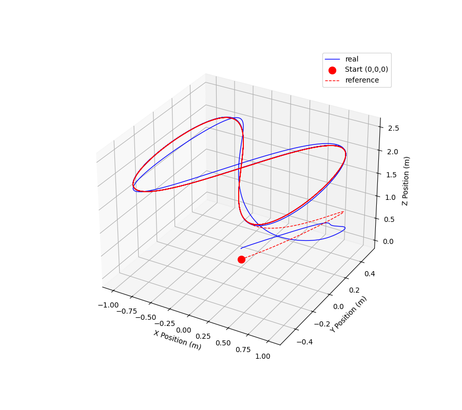

**第三组**

```python
N = 30 #预测步长
Q=np.diag([100,100,100,0,0,0,0,0,100, 0,0,0])
R = np.diag([10,10,10,10])
```

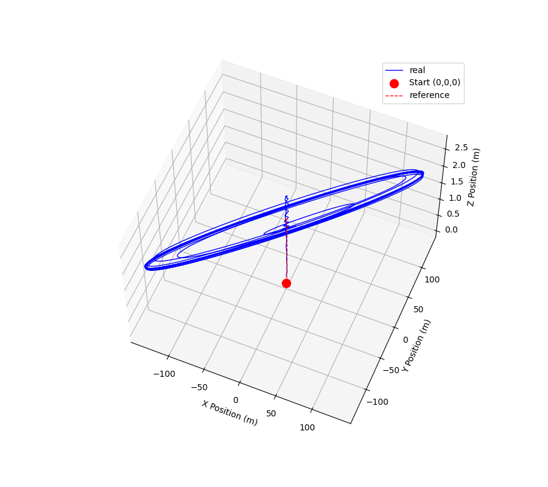

### 小板 tinympc
20250723
轨迹：position_8_traj_12MUL4.hpp
轨迹中样本点数：4000
优化程度：o2
Total time:29242669.69 us
平均单次计算时间：7369.624 us


### 小板 qpOASES
轨迹：position_fig8_traj_12MUL4.hpp (实际上是螺旋上升轨迹)
轨迹中样本点数：500
优化程度：o0
Total time: 1973352.51 us
平均单次计算时间：4085.616 us


20250723
轨迹：position_8_traj_12MUL4.hpp
轨迹中样本点数：4000
优化程度：o2
Total time: 9901123.47 us
平均单次计算时间：2495.243 us


## ROS仿真，不通过串口通信

### 用tinympc求解
20250716

```python
N = 30 #预测步长
Q=np.diag([10,10,10,1,1,1,1,1,1,1,1,1])
R = np.diag([0.1,0.1,0.1,0.1])
```

在这组参数下的效果比较好，但是实际轨迹**不能**达到与参考轨迹几乎一模一样的效果

以下是多圈的效果：

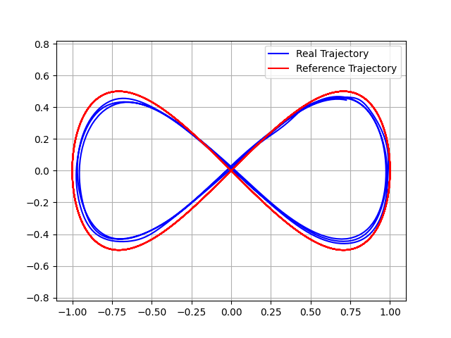

以下是1圈的效果：

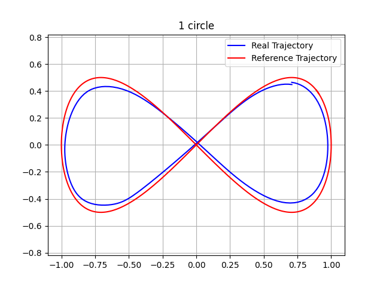


1圈的误差

```
=== Trajectory Error Metrics ===
xy MAE: 0.2715
xy RMSE: 0.2832
xy Max Error: 0.4393
xy Std Dev: 0.0806
xy Hausdorff Distance: 0.0725
=== Trajectory Error Metrics ===
MAE: 0.2731
RMSE: 0.2848
Max Error: 0.4412
Std Dev: 0.0806
Hausdorff Distance: 0.0758
Mean Z Error: 0.0287
Horizontal Error: 0.2715
```

## 同步异步的比较
20250725
无人机的位姿更新是通过gazebo的实时反馈来更新的,采用同步方式更新

实验采用相同的控制器：tinympc
相同的A,B: 1.05kg,50Hz离散化频率的A,B
相同的Q,R：
```python
Q = np.diag([10,10,10,1,1,1,1,1,1,1,1,1])
R = np.diag([0.1,0.1,0.1,0.1])
```

实验采用同样的8字型参考轨迹，参数如下：
```python
TIME_DURATION=40                              # 总时长 [S]
TIME_STEP= 0.005                             # 时间步长 [S]
TRAJ_SAMPLE_NUM=int(TIME_DURATION/TIME_STEP)  # 轨迹样本点数量
```
### 同步
使用同步 控制频率可以达到比较稳定的100Hz
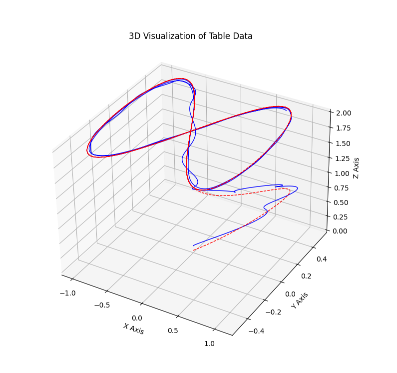
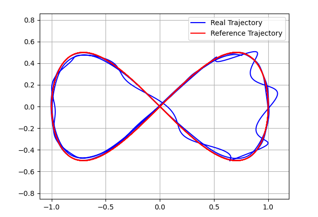

### 异步
使用异步 控制频率大约是90Hz
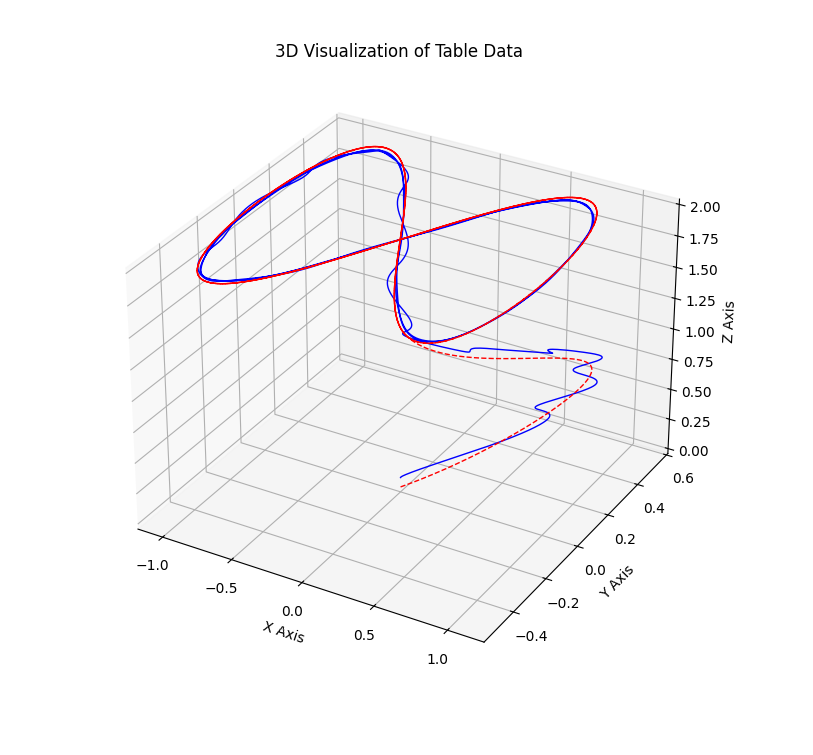
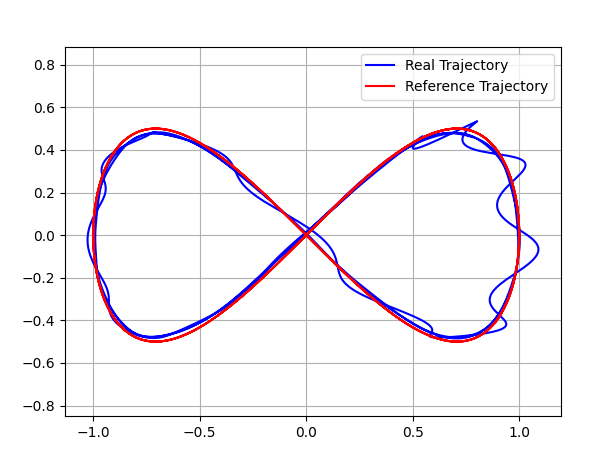

### 比较
比较两组图片可见，两种控制方式在该轨迹下的控制效果差不多
但是同步 的拟合效果相对好一些

### 总结
采用同步异步主要是通过影响控制频率，从而来影响控制效果


## 不同轨迹参数下，ROS仿真(不连接串口)的效果
20250726

无人机的位姿更新是通过gazebo的实时反馈来更新的,采用同步方式更新

实验采用相同的控制器：tinympc
相同的控制频率：100Hz
相同的A,B: 1.05kg,50Hz离散化频率的A,B
相同的Q,R：
```python
Q = np.diag([10,10,10,1,1,1,1,1,1,1,1,1])
R = np.diag([0.1,0.1,0.1,0.1])
```
实验采用同样的8字型参考轨迹，但是参数有所不同
不同之处：
- `TIME_DURATION`（总飞行时长）
- `TIME_STEP`（参考轨迹采样的时间步长）

### 轨迹参数1
```python
TIME_DURATION=80                               # 总时长 [S]
TIME_STEP= 0.02                             # 时间步长 [S]
TRAJ_SAMPLE_NUM=int(TIME_DURATION/TIME_STEP)  # 轨迹样本点数量
```

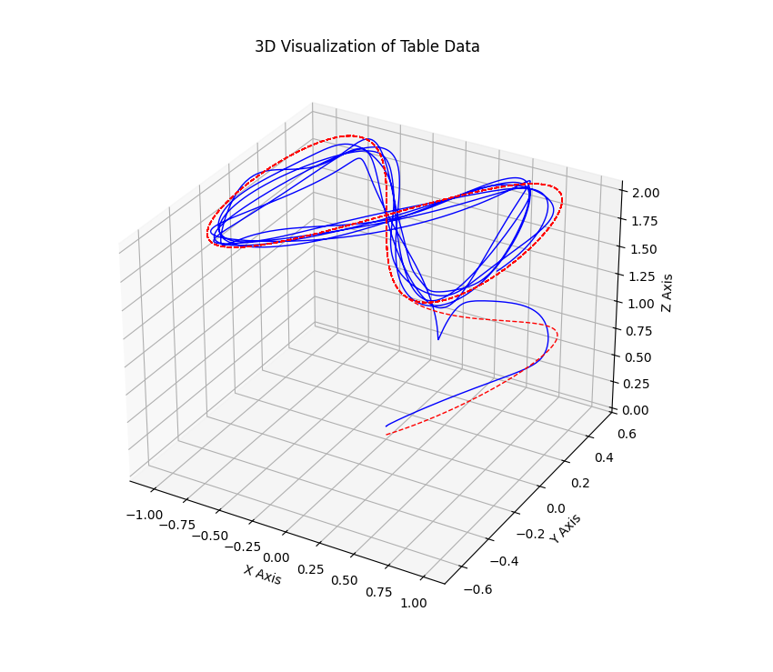
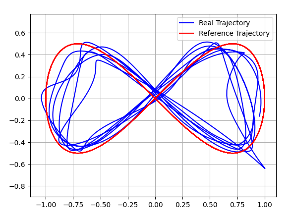

### 轨迹参数2
```python
TIME_DURATION=40                              # 总时长 [S]
TIME_STEP= 0.005                             # 时间步长 [S]
TRAJ_SAMPLE_NUM=int(TIME_DURATION/TIME_STEP)  # 轨迹样本点数量
```


### 比较
轨迹参数2 的 `TIME_STEP`（参考轨迹采样的时间步长）比轨迹参数1 更小，
控制效果上：虽然二者刚开始都有抖动，但是轨迹参数2 能够更快地拟合参考轨迹，且拟合效果会更加好。

### 总结
`TIME_STEP`（参考轨迹采样的时间步长）越小，可以使得参考点越密集，
从而无人机在相邻两次控制之间的**期望位移**较小，因此控制器求解得到的 控制量`u`会相对较小，使得无人机的飞行更稳定。避免了`u`过大，导致无人机无法及时调整的情况。

## A、B矩阵的离散化频率对控制效果的影响
20250725
在使用100Hz控制频率的情况下，发现使用离散化频率为 **50Hz**的A、B矩阵 比 离散化频率为 **100Hz**的A、B矩阵 控制效果会更好。
原因未知

## 总结：宋博改进后控制效果更好的原因
1. 同步通信，提高了控制频率
2. 参考轨迹的采样时间间隔缩小
3. 使用了比较适合的一组Q,R（也就是我之前调出来的那组Q,R）
```python
Q = np.diag([10,10,10,1,1,1,1,1,1,1,1,1])
R = np.diag([0.1,0.1,0.1,0.1])
```

4. 使用50Hz离散化后的A,B


## ROS连接串口仿真
20250726

### qpOASES
参数设定：
1. 轨迹为8字型，共8000个参考点
2. 使用50Hz离散化后的A,B
3. Q,R 如下：
```python
Q = np.diag([10,10,10,1,1,1,1,1,1,1,1,1])
R = np.diag([0.1,0.1,0.1,0.1])
```
问题设定：时不变（qpB）

相应的xk，uk, xref记录在`draw_traj_ROS\synchronize_data\qpOASES_uart_100Hz`目录下

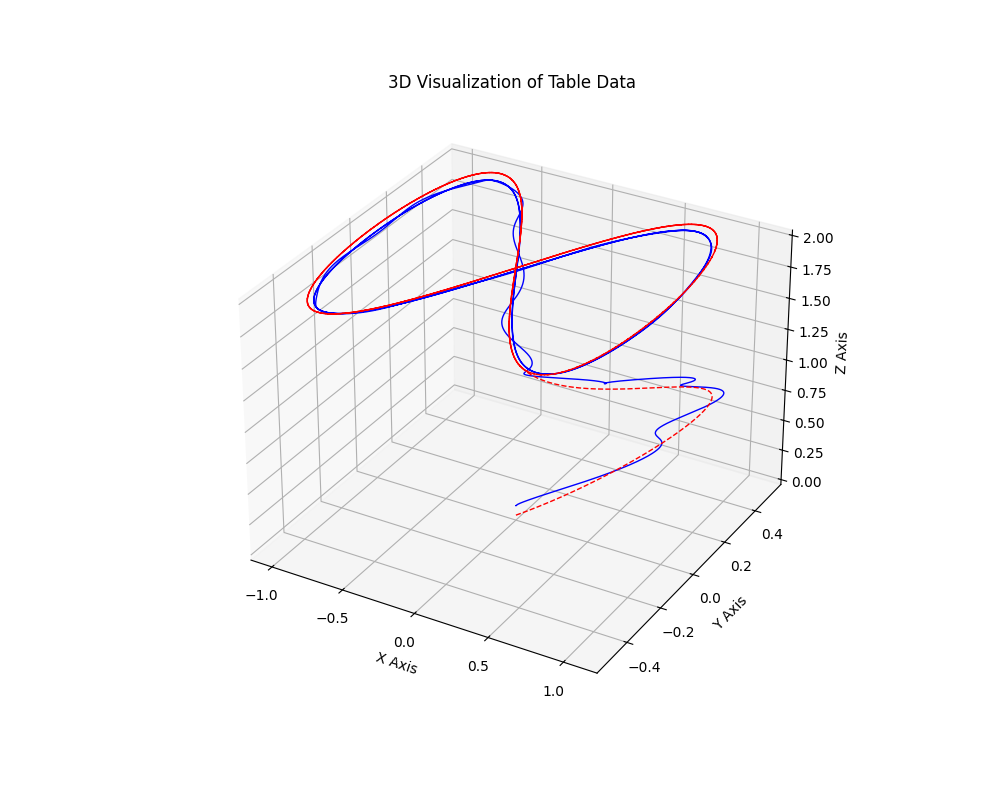


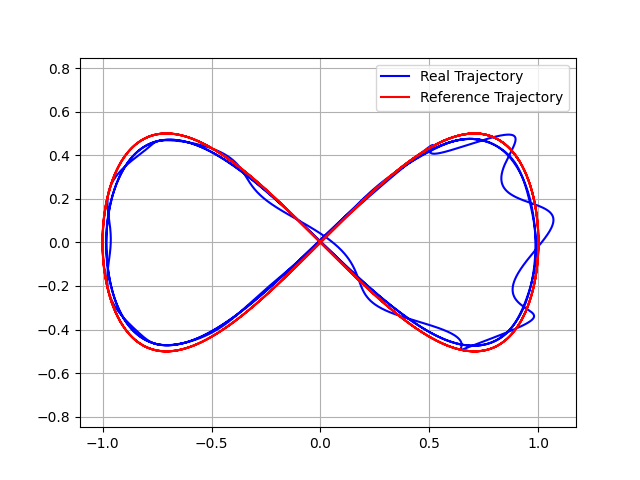

1 圈
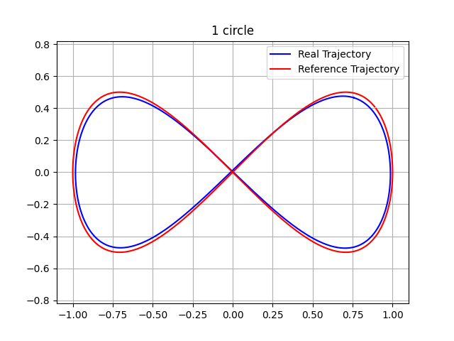

1 圈的误差
=== Trajectory Error Metrics ===
xy MAE: 0.2073
xy RMSE: 0.2133
xy Max Error: 0.3026
xy Std Dev: 0.0504
xy Hausdorff Distance: 0.0321
=== Trajectory Error Metrics ===
MAE: 0.2092
RMSE: 0.2151
Max Error: 0.3040
Std Dev: 0.0500
Hausdorff Distance: 0.0419
Mean Z Error: 0.0278
Horizontal Error: 0.2073


### tinympc
参数设定：
1. 轨迹为8字型，共8000个参考点
2. 使用50Hz离散化后的A,B
3. Q,R 如下：
```python
Q = np.diag([10,10,10,1,1,1,1,1,1,1,1,1])
R = np.diag([0.1,0.1,0.1,0.1])
```

问题设定：假时变，真时不变

相应的xk，uk, xref记录在`draw_traj_ROS\synchronize_data\tinympc_uart_100Hz`目录下

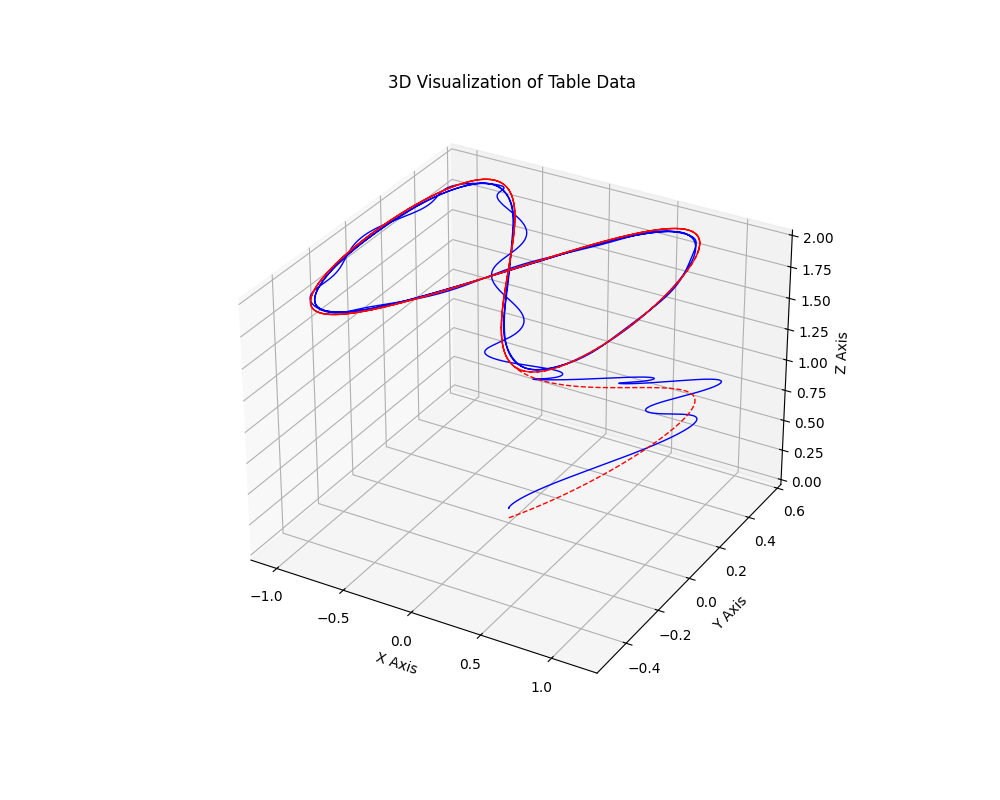


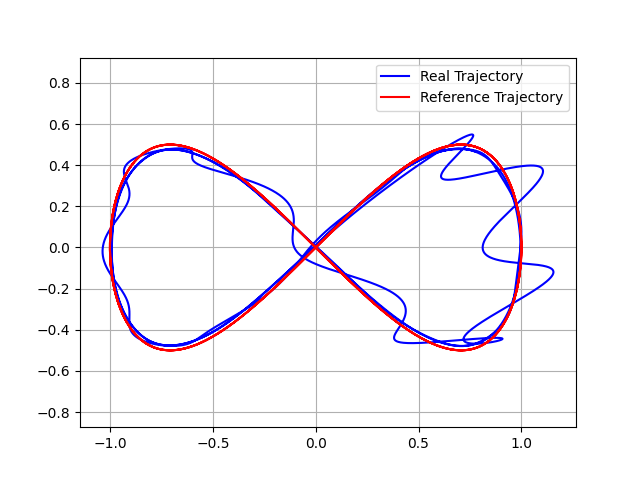

1 圈
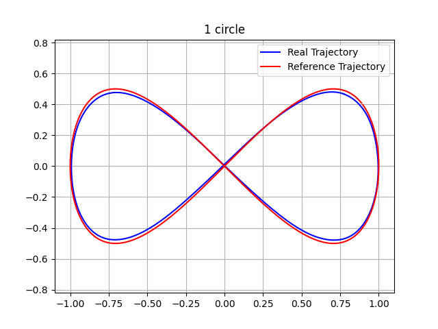


1 圈的误差
=== Trajectory Error Metrics ===
xy MAE: 0.1974
xy RMSE: 0.2030
xy Max Error: 0.2910
xy Std Dev: 0.0473
xy Hausdorff Distance: 0.0248
=== Trajectory Error Metrics ===
MAE: 0.1975
RMSE: 0.2031
Max Error: 0.2911
Std Dev: 0.0473
Hausdorff Distance: 0.0256
Mean Z Error: 0.0075
Horizontal Error: 0.1974


最后1圈的误差
|solver name|xy的RMSE |xyz的RMSE |
|---|---|---|
|qpOASES（时不变）|0.2133|0.2151|
|tinympc（假时变）|0.2030|0.2031|

### qpOASES
20250806
参数设定：
1. 轨迹为8字型，共8000个参考点
2. 使用50Hz离散化后的A,B
3. Q,R 如下：
```python
Q = np.diag([10,10,10,1,1,1,1,1,1,1,1,1])
R = np.diag([0.1,0.1,0.1,0.1])
```
问题设定：假时变（SQP），真时不变

结果：
在100Hz的控制频率下，使用qpOASES求解时变问题，单次求解需要约73ms,无法在10ms内求解完成,导致无人机无法正常飞行。

### tinmpc
20250806
参数设定：
1. 轨迹为8字型，共8000个参考点
2. 使用50Hz离散化后的A,B
3. Q,R 如下：
```python
Q = np.diag([10,10,10,1,1,1,1,1,1,1,1,1])
R = np.diag([0.1,0.1,0.1,0.1])
```
问题设定：假时变（SQP），真时不变

结果：
在100Hz的控制频率下，使用TinyMPC求解时变问题，如果不开优化(o0)，单次求解需要约11ms,无法在10ms内求解完成,导致无人机无法正常飞行。

如果开优化(o2)，可以飞行，效果如下：
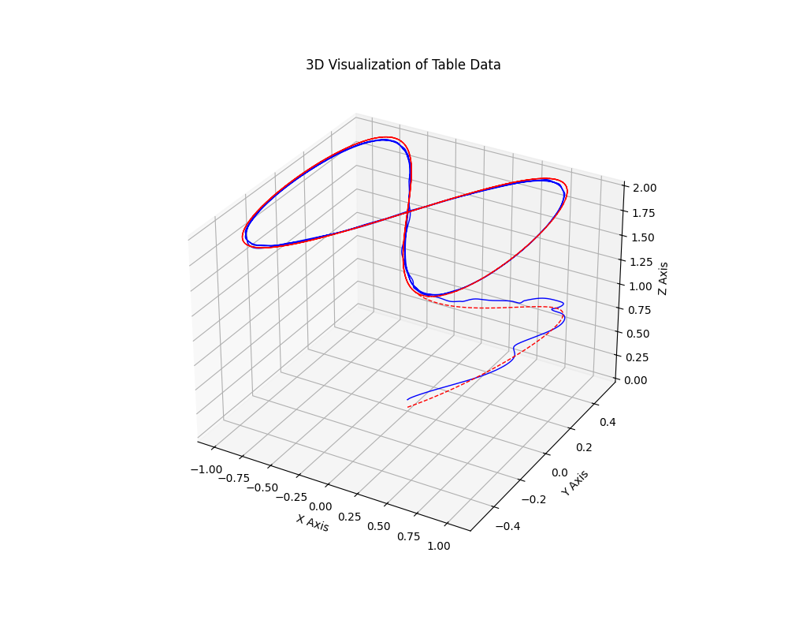


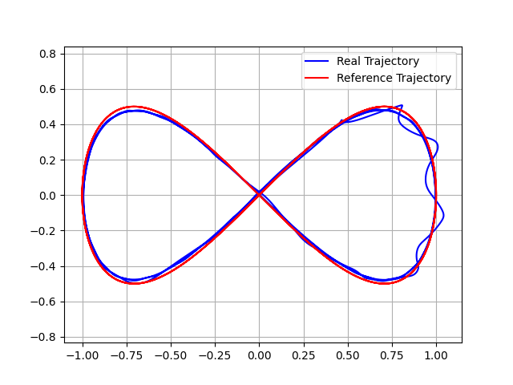

1 圈
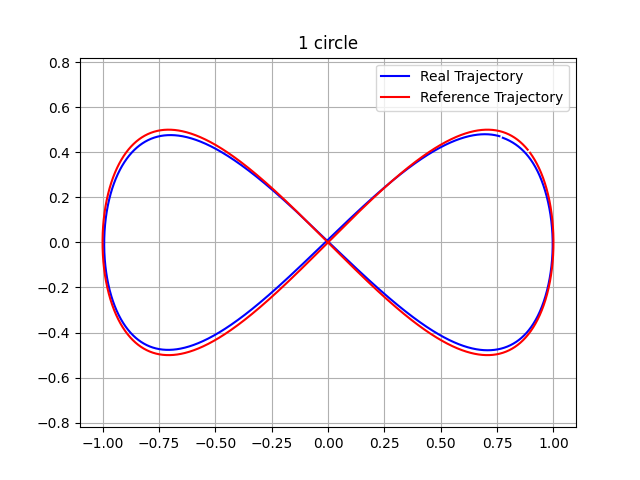

数据在：`draw_traj_ROS\synchronize_data\tinympc_uart_100Hz_time_vary`
平均求解时间约：2.4ms

### COD-MPC(我们的求解器)
20250806
参数设定：
1. 轨迹为8字型，共8000个参考点
2. 使用50Hz离散化后的A,B
3. Q,R 如下：
```python
Q = np.diag([10,10,10,1,1,1,1,1,1,1,1,1])
R = np.diag([0.1,0.1,0.1,0.1])
```
问题设定：假时变（SQP），真时不变

结果：
优化(o2)

如果开优化(o2)，可以飞行，效果如下：


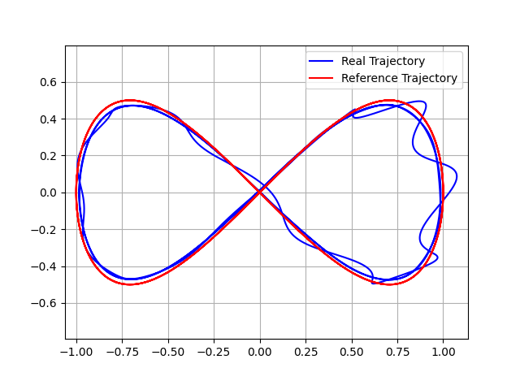

1 圈
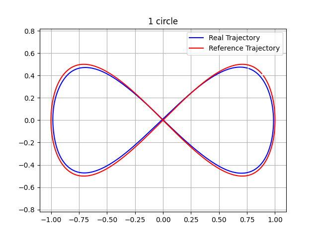

数据在：`draw_traj_ROS\synchronize_data\CODMPC_uart_100Hz_time_vary`
平均求解时间约：0.9ms
