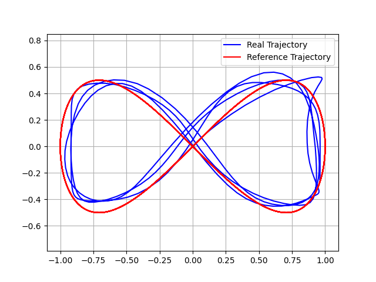
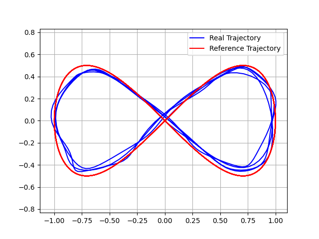
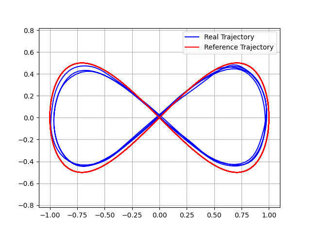
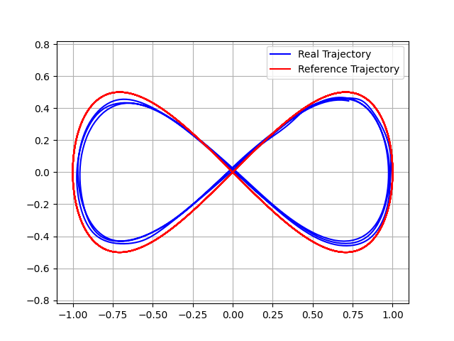

# 无人机仿真实验 记录

A，B为100Hz
Q=np.diag([10,10,10,1,1,1,1,1,1,1,1,1])
R = np.diag([10,10,10,10])

8字型轨迹
轨迹只有x,y,z，其余均为0
N=25

A，B为100Hz
Q=np.diag([10,10,10,1,1,1,1,1,1,1,1,1])
R = np.diag([10,10,10,10])

8字型轨迹
轨迹只有x,y,z，其余均为0
N=30

A，B为100Hz
Q=np.diag([10,10,10,1,1,1,1,1,1,1,1,1])
R = np.diag([1,1,1,1])
8字型轨迹
轨迹只有x,y,z，其余均为0
N=30

A，B为100Hz
Q=np.diag([10,10,10,1,1,1,1,1,1,1,1,1])
R = np.diag([0.1,0.1,0.1,0.1])
8字型轨迹
轨迹只有x,y,z，其余均为0
N=30

1圈

误差
=== Trajectory Error Metrics ===
xy MAE: 0.2715
xy RMSE: 0.2832
xy Max Error: 0.4393
xy Std Dev: 0.0806
xy Hausdorff Distance: 0.0725
=== Trajectory Error Metrics ===
MAE: 0.2731
RMSE: 0.2848
Max Error: 0.4412
Std Dev: 0.0806
Hausdorff Distance: 0.0758
Mean Z Error: 0.0287
Horizontal Error: 0.2715
