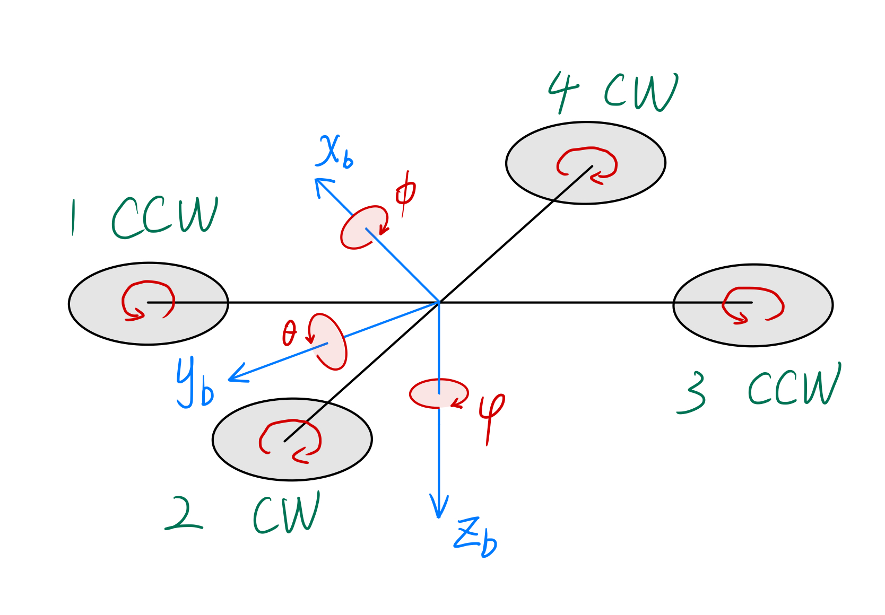

# 无人机模型和MPC控制算法

## 1.无人机建模

### 1.1 非线性模型

设状态向量
$$
\mathbf{x}=
\begin{bmatrix}
x\quad
y\quad
z\quad
\dot{x}\quad
\dot{y}\quad
\dot{z}\quad

\phi\quad
\theta\quad
\psi\quad
\dot{\phi}\quad
\dot{\theta}\quad
\dot{\psi}
\end{bmatrix}^\top
$$
设输入向量
$$
\mathbf{u}=
\begin{bmatrix}
T \quad \tau_{x} \quad \tau_{y} \quad \tau_{z}
\end{bmatrix}^\top
$$
则无人机模型可以表述为
$$
\mathbf{\dot{x}}=\mathbf{f}\left( \mathbf{x},\mathbf{u} \right)
$$
即：
$$
\begin{bmatrix}
\dot{x}\\
\dot{y}\\
\dot{z}\\
\ddot{x}\\
\ddot{y}\\
\ddot{z}\\

\dot{\phi}\\
\dot{\theta}\\
\dot{\psi}\\
\ddot{\phi}\\
\ddot{\theta}\\
\ddot{\psi}\\
\end{bmatrix}
=
\begin{bmatrix}
v_x\\
v_y\\
v_z\\
\frac{1}{m}T\left(cos\phi sin\theta cos\psi + sin\psi sin\phi \right)\\
\frac{1}{m}T\left(cos\phi sin\theta sin\psi - cos\psi sin\phi \right)\\
\frac{1}{m}T cos\theta cos\phi - g\\
\omega_{x}\\
\omega_{y}\\
\omega_{z}\\
\frac{1}{J_{xx}}\left[ \tau_{x} - \omega_{y} \omega_{z} \left(J_{yy}-J_{zz}\right)\right]\\
\frac{1}{J_{yy}}\left[ \tau_{y} - \omega_{z} \omega_{x} \left(J_{zz}-J_{xx}\right)\right]\\
\frac{1}{J_{zz}}\left[ \tau_{z} - \omega_{x} \omega_{y} \left(J_{xx}-J_{yy}\right)\right]\\
\end{bmatrix} 
\tag{1}
$$

### 1.2 线性化

上述的无人机模型是连续的非线性的模型，为了得到无人机模型的状态空间方程
$$
\mathbf{\dot{x}}=A\mathbf{x}+B\mathbf{u}\\
\mathbf{y}=C\mathbf{x}+D\mathbf{u}
$$
需要对无人机模型进行线性化，一般采用雅可比线性化

#### 1.2.1 雅可比线性化流程

非线性方程可以表示为以下的一般形式：
$$
\frac{dx}{dt}=f(x,y)\tag{2}
$$

##### Step1：寻找平衡点

平衡点（equilibrium point） (a,b)，满足
$$
f\left(a,b \right)=0 \tag{3}
$$

##### Step2：计算在平衡点处的一阶偏导数

根据多元函数泰勒展开公式，(2)式 在平衡点 (a,b)处的一阶泰勒展开式为：
$$
f(x,y) = f(a,b)+\frac{\partial f}{\partial x}(a,b)\cdot(x-a)+\frac{\partial f}{\partial y}(a,b)\cdot(y-b)+o(\Delta{x},\Delta{y})
$$
忽略无穷小项，得到
$$
f(x,y)= f(a,b)+\frac{\partial f}{\partial x}(a,b)\cdot(x-a)+\frac{\partial f}{\partial y}(a,b)\cdot(y-b) \tag{4}
$$
代入(3)，得
$$
f(x,y)= \frac{\partial f}{\partial x}(a,b)\cdot(x-a)+\frac{\partial f}{\partial y}(a,b)\cdot(y-b) \tag{5}
$$
得到两个一阶偏导数，分别记为
$$
A=\frac{\partial f}{\partial x}(a,b)\\
B=\frac{\partial f}{\partial y}(a,b) \tag{6}
$$

##### Step3：构成线性模型

记
$$
\widetilde{x}=x-a,\quad \widetilde{y}=y-b
$$
则(2)式被线性化为
$$
\frac{dx}{dt}=A\widetilde{x} + B\widetilde{y}
$$

#### 1.2.2 无人机模型的雅可比线性化

下面根据以上理论，对(1)式描述的无人机模型进行雅可比线性化

也就是由非线性方程
$$
\mathbf{\dot{x}}=f\left( \mathbf{x},\mathbf{u} \right)
$$
得到线性方程
$$
\mathbf{\dot{\widetilde{x}}}=A\cdot{\mathbf{\widetilde{x}}} + B\cdot{\mathbf{\widetilde{u}}}\\
其中:
\begin{cases}
\mathbf{\dot{\widetilde{x}}}=\mathbf{\dot{x}}\\
A=\frac{\partial{\mathbf{f}}}{\partial{\mathbf{x}}}\\
B=\frac{\partial{\mathbf{f}}}{\partial{\mathbf{u}}}\\
\mathbf{\widetilde{x}}=\mathbf{x}-\mathbf{x_e}\\
\mathbf{\widetilde{u}}=\mathbf{u}-\mathbf{u_e}
\end{cases}
$$

##### Step1：寻找平衡点

令(1)式右端等于0
$$
\begin{bmatrix}
v_x\\
v_y\\
v_z\\
\frac{1}{m}T\left(cos\phi sin\theta cos\psi + sin\psi sin\phi \right)\\
\frac{1}{m}T\left(cos\phi sin\theta sin\psi - cos\psi sin\phi \right)\\
\frac{1}{m}T cos\theta cos\phi - g\\
\omega_{x}\\
\omega_{y}\\
\omega_{z}\\
\frac{1}{J_{xx}}\left[ \tau_{x} - \omega_{y} \omega_{z} \left(J_{yy}-J_{zz}\right)\right]\\
\frac{1}{J_{xx}}\left[ \tau_{y} - \omega_{z} \omega_{x} \left(J_{zz}-J_{xx}\right)\right]\\
\frac{1}{J_{xx}}\left[ \tau_{z} - \omega_{x} \omega_{y} \left(J_{xx}-J_{yy}\right)\right]\\
\end{bmatrix} 
=\mathbf{0}
\tag{7}
$$
可得
$$
\begin{cases}
v_x=0 \\ 
v_y=0\\
v_z=0\\
\frac{1}{m}T\left(cos\phi sin\theta cos\psi + sin\psi sin\phi \right)=0\\
\frac{1}{m}T\left(cos\phi sin\theta sin\psi - cos\psi sin\phi \right)=0\\
\frac{1}{m}T cos\theta cos\phi = g\\

\omega_{x}=0\\
\omega_{y}=0\\
\omega_{z}=0\\
\tau_{x}=0\\
\tau_{y}=0\\
\tau_{z}=0\\
\end{cases}\tag{8}
$$
考虑在悬停点处，有
$$
\begin{cases}
T=mg\\
\phi=0\\
\theta=0\\
\psi=0\\
\end{cases}\tag{9}
$$
把(9)代入(8)，发现恰好满足(8)中的12个方程。说明悬停点正好也是平衡点。

又因为，大部分情况下，无人机状态是悬停状态或者接近悬停状态。所以使用悬停点这个平衡点来进行后面的线性化。

悬停点这个平衡点表示为
$$
\mathbf{x_e}=
\begin{bmatrix}
x_e\\
y_e\\
z_e\\
0\\
0\\
0\\

0\\
0\\
0\\

0\\
0\\
0\\
\end{bmatrix}
,\quad

\mathbf{u_e}=
\begin{bmatrix}
mg\\

0\\
0\\
0\\
\end{bmatrix}
$$

##### Step2：计算平衡点处一阶偏导数

**f** 对**x**求偏导
$$
\frac{\partial{\dot{x}}}{\partial{\mathbf{x}}}=
\begin{bmatrix}
0 \quad 0 \quad 0 \quad 1 \quad 0 \quad 0 \quad 0 \quad 0 \quad 0 \quad 0 \quad 0 \quad 0 
\end{bmatrix}
$$

$$
\frac{\partial{\dot{y}}}{\partial{\mathbf{x}}}=
\begin{bmatrix}
0 \quad 0 \quad 0 \quad 0 \quad 1 \quad 0 \quad 0 \quad 0 \quad 0 \quad 0 \quad 0 \quad 0 
\end{bmatrix}
$$

$$
\frac{\partial{\dot{z}}}{\partial{\mathbf{x}}}=
\begin{bmatrix}
0 \quad 0 \quad 0 \quad 0 \quad 0 \quad 1 \quad 0 \quad 0 \quad 0 \quad 0 \quad 0 \quad 0 
\end{bmatrix}
$$

$$
\frac{\partial{\ddot{x}}}{\partial{\mathbf{x}}}=
\begin{bmatrix}
0 \\ 
0 \\ 
0 \\
0 \\
0 \\
0 \\
\frac{1}{m}T\left(-sin\phi sin\theta cos\psi + sin\psi cos\phi \right) \\
\frac{1}{m}T\left(cos\phi cos\theta cos\psi + sin\psi sin\phi \right) \\
\frac{1}{m}T\left(-cos\phi sin\theta sin\psi + cos\psi sin\phi \right) \\
0 \\
0 \\
0 
\end{bmatrix}^\top

,\quad

\frac{\partial{\ddot{x}}}{\partial{\mathbf{x}}}\big|_{\mathbf{x}=\mathbf{x_{e}}}=
\begin{bmatrix}
0 \\ 
0 \\ 
0 \\
0 \\
0 \\
0 \\

0 \\
g \\
0 \\

0 \\
0 \\
0 
\end{bmatrix}^\top
$$

$$
\frac{\partial{\ddot{y}}}{\partial{\mathbf{x}}}=
\begin{bmatrix}
0 \\ 
0 \\ 
0 \\
0 \\
0 \\
0 \\
\frac{1}{m}T\left(-sin\phi sin\theta sin\psi - cos\psi cos\phi \right)\\
\frac{1}{m}T\left(cos\phi cos\theta sin\psi - cos\psi sin\phi \right)\\
\frac{1}{m}T\left(cos\phi sin\theta cos\psi + sin\psi sin\phi \right)\\
0 \\
0 \\
0 
\end{bmatrix}^\top

,\quad

\frac{\partial{\ddot{y}}}{\partial{\mathbf{x}}} \big|_{\mathbf{x}=\mathbf{x_{e}}}=
\begin{bmatrix}
0 \\ 
0 \\ 
0 \\
0 \\
0 \\
0 \\

-g\\
0\\
0\\

0 \\
0 \\
0 
\end{bmatrix}^\top
$$

$$
\frac{\partial{\ddot{z}}}{\partial{\mathbf{x}}}=
\begin{bmatrix}
0 \\ 
0 \\ 
0 \\
0 \\
0 \\
0 \\
-\frac{1}{m}T cos\theta sin\phi\\
-\frac{1}{m}T sin\theta cos\phi\\
0\\
0 \\
0 \\
0 
\end{bmatrix}^\top

,\quad

\frac{\partial{\ddot{z}}}{\partial{\mathbf{x}}}  \big|_{\mathbf{x}=\mathbf{x_{e}}}=
\begin{bmatrix}
0 \\ 
0 \\ 
0 \\
0 \\
0 \\
0 \\

0\\
0\\
0\\

0 \\
0 \\
0 
\end{bmatrix}^\top
$$

$$
\frac{\partial{\dot{\phi}}}{\partial{\mathbf{x}}}=
\begin{bmatrix}
0 \quad 0 \quad 0 \quad 0 \quad 0 \quad 0 \quad 0 \quad 0 \quad 0 \quad 1 \quad 0 \quad 0 
\end{bmatrix}
$$

$$
\frac{\partial{\dot{\theta}}}{\partial{\mathbf{x}}}=
\begin{bmatrix}
0 \quad 0 \quad 0 \quad 0 \quad 0 \quad 0 \quad 0 \quad 0 \quad 0 \quad 0 \quad 1 \quad 0 
\end{bmatrix}
$$

$$
\frac{\partial{\dot{\psi}}}{\partial{\mathbf{x}}}=
\begin{bmatrix}
0 \quad 0 \quad 0 \quad 0 \quad 0 \quad 0 \quad 0 \quad 0 \quad 0 \quad 0 \quad 0 \quad 1 
\end{bmatrix}
$$

$$
\frac{\partial{\ddot{\phi}}}{\partial{\mathbf{x}}}=
\begin{bmatrix}
0 \quad 0 \quad 0 \quad 0 \quad 0 \quad 0 \quad 0 \quad 0 \quad 0 \quad 0 \quad 0 \quad 0 
\end{bmatrix}
$$

$$
\frac{\partial{\ddot{\theta}}}{\partial{\mathbf{x}}}=
\begin{bmatrix}
0 \quad 0 \quad 0 \quad 0 \quad 0 \quad 0 \quad 0 \quad 0 \quad 0 \quad 0 \quad 0 \quad 0 
\end{bmatrix}
$$

$$
\frac{\partial{\ddot{\psi}}}{\partial{\mathbf{x}}}=
\begin{bmatrix}
0 \quad 0 \quad 0 \quad 0 \quad 0 \quad 0 \quad 0 \quad 0 \quad 0 \quad 0 \quad 0 \quad 0 
\end{bmatrix}
$$

从而构成矩阵A
$$
A=\frac{\partial{\mathbf{f}}}{\partial{\mathbf{x}}}  \big|_{\mathbf{x}=\mathbf{x_{e}}}=
\begin{bmatrix}
0 \quad 0 \quad 0 \quad 1 \quad 0 \quad 0 \quad 0 \quad 0 \quad 0 \quad 0 \quad 0 \quad 0 \\
0 \quad 0 \quad 0 \quad 0 \quad 1 \quad 0 \quad 0 \quad 0 \quad 0 \quad 0 \quad 0 \quad 0 \\
0 \quad 0 \quad 0 \quad 0 \quad 0 \quad 1 \quad 0 \quad 0 \quad 0 \quad 0 \quad 0 \quad 0 \\

0 \quad 0 \quad 0 \quad 0 \quad 0 \quad 0 \quad 0 \quad g \quad 0 \quad 0 \quad 0 \quad 0\\

0 \quad 0 \quad 0 \quad 0 \quad 0 \quad 0 \quad {-g}\quad 0\quad 0\quad 0 \quad 0 \quad 0\\

0 \quad 0 \quad 0 \quad 0 \quad 0 \quad 0 \quad 0 \quad 0 \quad 0 \quad 0 \quad 0 \quad 0\\

0 \quad 0 \quad 0 \quad 0 \quad 0 \quad 0 \quad 0 \quad 0 \quad 0 \quad 1 \quad 0 \quad 0 \\
0 \quad 0 \quad 0 \quad 0 \quad 0 \quad 0 \quad 0 \quad 0 \quad 0 \quad 0 \quad 1 \quad 0 \\
0 \quad 0 \quad 0 \quad 0 \quad 0 \quad 0 \quad 0 \quad 0 \quad 0 \quad 0 \quad 0 \quad 1 \\

0 \quad 0 \quad 0 \quad 0 \quad 0 \quad 0 \quad 0 \quad 0 \quad 0 \quad 0 \quad 0 \quad 0\\
0 \quad 0 \quad 0 \quad 0 \quad 0 \quad 0 \quad 0 \quad 0 \quad 0 \quad 0 \quad 0 \quad 0\\
0 \quad 0 \quad 0 \quad 0 \quad 0 \quad 0 \quad 0 \quad 0 \quad 0 \quad 0 \quad 0 \quad 0
\end{bmatrix} \tag{10}
$$
**f** 对**u**求偏导
$$
\frac{\partial{\dot{x}}}{\partial{\mathbf{u}}}=
\begin{bmatrix}
0 \quad 0 \quad 0 \quad 0 
\end{bmatrix}
$$

$$
\frac{\partial{\dot{y}}}{\partial{\mathbf{u}}}=
\begin{bmatrix}
0 \quad 0 \quad 0 \quad 0 
\end{bmatrix}
$$

$$
\frac{\partial{\dot{z}}}{\partial{\mathbf{u}}}=
\begin{bmatrix}
0 \quad 0 \quad 0 \quad 0 
\end{bmatrix}
$$

$$
\frac{\partial{\ddot{x}}}{\partial{\mathbf{u}}}=
\begin{bmatrix}
\frac{1}{m}\left(cos\phi sin\theta cos\psi + sin\psi sin\phi \right) \quad 0 \quad 0 \quad 0 
\end{bmatrix}

,\quad

\frac{\partial{\ddot{x}}}{\partial{\mathbf{u}}} \big|_{\mathbf{u}=\mathbf{u_e}}=
\begin{bmatrix}
0 \quad 0 \quad 0\quad 0 
\end{bmatrix}
$$

$$
\frac{\partial{\ddot{y}}}{\partial{\mathbf{u}}}=
\begin{bmatrix}
\frac{1}{m}\left(cos\phi sin\theta sin\psi - cos\psi sin\phi \right) \quad 0 \quad 0 \quad  0 
\end{bmatrix}

,\quad

\frac{\partial{\ddot{y}}}{\partial{\mathbf{u}}} \big|_{\mathbf{u}=\mathbf{u_e}}=
\begin{bmatrix}
0 \quad 0 \quad 0\quad 0 
\end{bmatrix}
$$

$$
\frac{\partial{\ddot{z}}}{\partial{\mathbf{u}}}=
\begin{bmatrix}
\frac{1}{m}cos\theta cos\phi \quad 0 \quad 0 \quad 0 
\end{bmatrix}

,\quad

\frac{\partial{\ddot{z}}}{\partial{\mathbf{u}}} \big|_{\mathbf{u}=\mathbf{u_e}}=
\begin{bmatrix}
\frac{1}{m} \quad 0 \quad 0\quad 0 
\end{bmatrix}
$$

$$
\frac{\partial{\dot{\phi}}}{\partial{\mathbf{u}}}=
\begin{bmatrix}
0 \quad 0 \quad 0 \quad 0 
\end{bmatrix}
$$

$$
\frac{\partial{\dot{\theta}}}{\partial{\mathbf{u}}}=
\begin{bmatrix}
0 \quad 0 \quad 0 \quad 0 
\end{bmatrix}
$$

$$
\frac{\partial{\dot{\psi}}}{\partial{\mathbf{u}}}=
\begin{bmatrix}
0 \quad 0 \quad 0 \quad 0
\end{bmatrix}
$$

$$
\frac{\partial{\ddot{\phi}}}{\partial{\mathbf{u}}}=
\begin{bmatrix}
0 \quad \frac{1}{J_{xx}}\quad 0 \quad 0 
\end{bmatrix}
$$

$$
\frac{\partial{\ddot{\theta}}}{\partial{\mathbf{u}}}=
\begin{bmatrix}
0 \quad 0 \quad \frac{1}{J_{}yy} \quad 0 
\end{bmatrix}
$$

$$
\frac{\partial{\ddot{\psi}}}{\partial{\mathbf{u}}}=
\begin{bmatrix}
0 \quad 0 \quad 0 \quad \frac{1}{J_{zz}}
\end{bmatrix}
$$

从而构成矩阵B
$$
B=\frac{\partial{\mathbf{f}}}{\partial{\mathbf{u}}}  \big|_{\mathbf{u}=\mathbf{u_{e}}}=
\begin{bmatrix}
0 \quad 0 \quad 0 \quad 0 \\
0 \quad 0 \quad 0 \quad 0 \\
0 \quad 0 \quad 0 \quad 0 \\

0 \quad 0 \quad 0 \quad 0 \\
0 \quad 0 \quad 0 \quad 0 \\
\frac{1}{m} \quad 0 \quad 0\quad 0 \\

0 \quad 0 \quad 0 \quad 0 \\
0 \quad 0 \quad 0 \quad 0 \\
0 \quad 0 \quad 0 \quad 0 \\

0 \quad \frac{1}{J_{xx}}\quad 0 \quad 0 \\
0 \quad 0 \quad \frac{1}{J_{}yy} \quad 0 \\
0 \quad 0 \quad 0 \quad \frac{1}{J_{zz}}
\end{bmatrix} \tag{11}
$$

##### Step3：构成线性模型

记
$$
\mathbf{\widetilde{x}}=\mathbf{x}-\mathbf{x_e},\quad
\mathbf{\widetilde{u}}=\mathbf{u}-\mathbf{u_e}
\tag{12}
$$
所以，
$$
\mathbf{\dot{\widetilde{x}}}=\frac{d\mathbf{\widetilde{x}}}{dt}=\frac{d \left(\mathbf{\mathbf{x}-\mathbf{x_e}} \right)}{dt}=\frac{d\mathbf{x}}{dt}=\mathbf{\dot{x}}
$$
从而综合(10),(11),(12) 得到线性模型
$$
\mathbf{\dot{\widetilde{x}}}=A\cdot{\mathbf{\widetilde{x}}} + B\cdot{\mathbf{\widetilde{u}}}
\tag{13}
$$
由于**y**一般取12个状态量中的某几个，比如：x,y,z,yaw。

所以**y**一般与**x**，**u**是线性关系，不需要线性化

从而，总的线性模型为
$$
\mathbf{\dot{\widetilde{x}}}=A\cdot{\mathbf{\widetilde{x}}} + B\cdot{\mathbf{\widetilde{u}}}\\
\mathbf{y}=C\mathbf{x}+D\mathbf{u}
\tag{13}
$$

即
$$
\mathbf{\dot{\widetilde{x}}}=

\begin{bmatrix}
0 \quad 0 \quad 0 \quad 1 \quad 0 \quad 0 \quad 0 \quad 0 \quad 0 \quad 0 \quad 0 \quad 0 \\
0 \quad 0 \quad 0 \quad 0 \quad 1 \quad 0 \quad 0 \quad 0 \quad 0 \quad 0 \quad 0 \quad 0 \\
0 \quad 0 \quad 0 \quad 0 \quad 0 \quad 1 \quad 0 \quad 0 \quad 0 \quad 0 \quad 0 \quad 0 \\

0 \quad 0 \quad 0 \quad 0 \quad 0 \quad 0 \quad 0 \quad g \quad 0 \quad 0 \quad 0 \quad 0\\

0 \quad 0 \quad 0 \quad 0 \quad 0 \quad 0 \quad {-g}\quad 0\quad 0\quad 0 \quad 0 \quad 0\\

0 \quad 0 \quad 0 \quad 0 \quad 0 \quad 0 \quad 0 \quad 0 \quad 0 \quad 0 \quad 0 \quad 0\\

0 \quad 0 \quad 0 \quad 0 \quad 0 \quad 0 \quad 0 \quad 0 \quad 0 \quad 1 \quad 0 \quad 0 \\
0 \quad 0 \quad 0 \quad 0 \quad 0 \quad 0 \quad 0 \quad 0 \quad 0 \quad 0 \quad 1 \quad 0 \\
0 \quad 0 \quad 0 \quad 0 \quad 0 \quad 0 \quad 0 \quad 0 \quad 0 \quad 0 \quad 0 \quad 1 \\

0 \quad 0 \quad 0 \quad 0 \quad 0 \quad 0 \quad 0 \quad 0 \quad 0 \quad 0 \quad 0 \quad 0\\
0 \quad 0 \quad 0 \quad 0 \quad 0 \quad 0 \quad 0 \quad 0 \quad 0 \quad 0 \quad 0 \quad 0\\
0 \quad 0 \quad 0 \quad 0 \quad 0 \quad 0 \quad 0 \quad 0 \quad 0 \quad 0 \quad 0 \quad 0
\end{bmatrix}
\cdot{\mathbf{\widetilde{x}}} + 

\begin{bmatrix}
0 \quad 0 \quad 0 \quad 0 \\
0 \quad 0 \quad 0 \quad 0 \\
0 \quad 0 \quad 0 \quad 0 \\

0 \quad 0 \quad 0 \quad 0 \\
0 \quad 0 \quad 0 \quad 0 \\
\frac{1}{m} \quad 0 \quad 0\quad 0 \\

0 \quad 0 \quad 0 \quad 0 \\
0 \quad 0 \quad 0 \quad 0 \\
0 \quad 0 \quad 0 \quad 0 \\

0 \quad \frac{1}{J_{xx}}\quad 0 \quad 0 \\
0 \quad 0 \quad \frac{1}{J_{}yy} \quad 0 \\
0 \quad 0 \quad 0 \quad \frac{1}{J_{zz}}
\end{bmatrix}
\cdot{\mathbf{\widetilde{u}}}\\
$$

### 1.3 离散化

参考自[【离散系统】传递函数和状态空间方程离散化_离散传递函数转换为状态方程csdn-CSDN博客](https://blog.csdn.net/weixin_41276397/article/details/130233070#信号保持—零阶保持器)

#### 1.3.1 欧拉法介绍

对于以下连续线性状态空间方程
$$
\mathbf{\dot{x}}=A\mathbf{x}+B\mathbf{u}\\
\mathbf{y}=C\mathbf{x}+D\mathbf{u}
$$
设在第k状态下，离散的线性状态空间方程如下：
$$
\mathbf{\dot{x}_{[k]}}=A\mathbf{x_{[k]}}+B\mathbf{u_{[k]}}\\
\mathbf{y_{[k]}}=C\mathbf{x_{[k]}}+D\mathbf{u_{[k]}}
\tag{14}
$$
设采样周期为**Ts**，则
$$
\mathbf{\dot{x}_{[k]}}=\frac{\mathbf{x_{[k+1]}}-\mathbf{x_{[k]}}}{T_s
}
\tag{15}
$$
j将(15)代入方程(14)得
$$
\frac{\mathbf{x_{[k+1]}}-\mathbf{x_{[k]}}}{T_s
}=A\mathbf{x_{[k]}}+B\mathbf{u_{[k]}}
$$
移项得
$$
\mathbf{x_{[k+1]}}=\left(I+{T_s}A \right) \mathbf{x_{[k]}}+ {T_s}B \mathbf{u_{[k]}}
$$
所以离散化后的矩阵A，B为
$$
A_d=I+{T_s}A\\
B_d={T_s}B
\tag{16}
$$
而离散化后的矩阵C，D不变
$$
C_d=C\\
D_d=D
\tag{17}
$$
从而，离散状态空间方程为
$$
\mathbf{x_{[k+1]}}=A_d\mathbf{x_{[k]}}+ B_d \mathbf{u_{[k]}}\\
\mathbf{y_{[k]}}=C_d\mathbf{x_{[k]}}+D_d \mathbf{u_{[k]}}
$$

#### 1.3.2 无人机模型的欧拉法离散化

由上文得到的线性化模型（式13）
$$
\mathbf{\dot{\widetilde{x}}}=A\cdot{\mathbf{\widetilde{x}}} + B\cdot{\mathbf{\widetilde{u}}}\\
\mathbf{y}=C\mathbf{x}+D\mathbf{u}
$$

$$
\mathbf{A}=

\begin{bmatrix}
0 \quad 0 \quad 0 \quad 1 \quad 0 \quad 0 \quad 0 \quad 0 \quad 0 \quad 0 \quad 0 \quad 0 \\
0 \quad 0 \quad 0 \quad 0 \quad 1 \quad 0 \quad 0 \quad 0 \quad 0 \quad 0 \quad 0 \quad 0 \\
0 \quad 0 \quad 0 \quad 0 \quad 0 \quad 1 \quad 0 \quad 0 \quad 0 \quad 0 \quad 0 \quad 0 \\

0 \quad 0 \quad 0 \quad 0 \quad 0 \quad 0 \quad 0 \quad g \quad 0 \quad 0 \quad 0 \quad 0\\

0 \quad 0 \quad 0 \quad 0 \quad 0 \quad 0 \quad {-g}\quad 0\quad 0\quad 0 \quad 0 \quad 0\\

0 \quad 0 \quad 0 \quad 0 \quad 0 \quad 0 \quad 0 \quad 0 \quad 0 \quad 0 \quad 0 \quad 0\\

0 \quad 0 \quad 0 \quad 0 \quad 0 \quad 0 \quad 0 \quad 0 \quad 0 \quad 1 \quad 0 \quad 0 \\
0 \quad 0 \quad 0 \quad 0 \quad 0 \quad 0 \quad 0 \quad 0 \quad 0 \quad 0 \quad 1 \quad 0 \\
0 \quad 0 \quad 0 \quad 0 \quad 0 \quad 0 \quad 0 \quad 0 \quad 0 \quad 0 \quad 0 \quad 1 \\

0 \quad 0 \quad 0 \quad 0 \quad 0 \quad 0 \quad 0 \quad 0 \quad 0 \quad 0 \quad 0 \quad 0\\
0 \quad 0 \quad 0 \quad 0 \quad 0 \quad 0 \quad 0 \quad 0 \quad 0 \quad 0 \quad 0 \quad 0\\
0 \quad 0 \quad 0 \quad 0 \quad 0 \quad 0 \quad 0 \quad 0 \quad 0 \quad 0 \quad 0 \quad 0
\end{bmatrix}, 
\qquad
\mathbf{B}=
\begin{bmatrix}
0 \quad 0 \quad 0 \quad 0 \\
0 \quad 0 \quad 0 \quad 0 \\
0 \quad 0 \quad 0 \quad 0 \\

0 \quad 0 \quad 0 \quad 0 \\
0 \quad 0 \quad 0 \quad 0 \\
\frac{1}{m} \quad 0 \quad 0\quad 0 \\

0 \quad 0 \quad 0 \quad 0 \\
0 \quad 0 \quad 0 \quad 0 \\
0 \quad 0 \quad 0 \quad 0 \\

0 \quad \frac{1}{J_{xx}}\quad 0 \quad 0 \\
0 \quad 0 \quad \frac{1}{J_{}yy} \quad 0 \\
0 \quad 0 \quad 0 \quad \frac{1}{J_{zz}}
\end{bmatrix}
$$
利用欧拉法离散化，得到
$$
\mathbf{A_d}=

\begin{bmatrix}
1 \quad 0 \quad 0 \quad T_s \quad 0 \quad 0 \quad 0 \quad 0 \quad 0 \quad 0 \quad 0 \quad 0 \\

0 \quad 1 \quad 0 \quad 0 \quad T_s \quad 0 \quad 0 \quad 0 \quad 0 \quad 0 \quad 0 \quad 0 \\

0 \quad 0 \quad 1 \quad 0 \quad 0 \quad T_s \quad 0 \quad 0 \quad 0 \quad 0 \quad 0 \quad 0 \\

0 \quad 0 \quad 0 \quad 1 \quad 0 \quad 0 \quad 0 \quad T_sg \quad 0 \quad 0 \quad 0 \quad 0\\

0 \quad 0 \quad 0 \quad 0 \quad 1 \quad 0 \quad {-T_sg}\quad 0\quad 0\quad 0 \quad 0 \quad 0\\

0 \quad 0 \quad 0 \quad 0 \quad 0 \quad 1 \quad 0 \quad 0 \quad 0 \quad 0 \quad 0 \quad 0\\

0 \quad 0 \quad 0 \quad 0 \quad 0 \quad 0 \quad 1 \quad 0 \quad 0 \quad T_s \quad 0 \quad 0 \\

0 \quad 0 \quad 0 \quad 0 \quad 0 \quad 0 \quad 0 \quad 1 \quad 0 \quad 0 \quad T_s \quad 0 \\

0 \quad 0 \quad 0 \quad 0 \quad 0 \quad 0 \quad 0 \quad 0 \quad 1 \quad 0 \quad 0 \quad T_s \\

0 \quad 0 \quad 0 \quad 0 \quad 0 \quad 0 \quad 0 \quad 0 \quad 0 \quad 1 \quad 0 \quad 0\\

0 \quad 0 \quad 0 \quad 0 \quad 0 \quad 0 \quad 0 \quad 0 \quad 0 \quad 0 \quad 1 \quad 0\\

0 \quad 0 \quad 0 \quad 0 \quad 0 \quad 0 \quad 0 \quad 0 \quad 0 \quad 0 \quad 0 \quad 1
\end{bmatrix}, 
\qquad

\mathbf{B_d}=
\begin{bmatrix}
0 \quad 0 \quad 0 \quad 0 \\
0 \quad 0 \quad 0 \quad 0 \\
0 \quad 0 \quad 0 \quad 0 \\

0 \quad 0 \quad 0 \quad 0 \\
0 \quad 0 \quad 0 \quad 0 \\
\frac{1}{m}T_s \quad 0 \quad 0\quad 0 \\

0 \quad 0 \quad 0 \quad 0 \\
0 \quad 0 \quad 0 \quad 0 \\
0 \quad 0 \quad 0 \quad 0 \\

0 \quad \frac{1}{J_{xx}}T_s\quad 0 \quad 0 \\
0 \quad 0 \quad \frac{1}{J_{}yy}T_s \quad 0 \\
0 \quad 0 \quad 0 \quad \frac{1}{J_{zz}}T_s
\end{bmatrix}
$$

#### 1.3.3 零阶保持法介绍

推导略
$$
A_d=e^{A T_s}\\
B_d=B\int_{0}^{T_s}e^{At}\,dt
$$
而离散化后的矩阵C，D不变
$$
C_d=C\\
D_d=D
$$
从而，离散状态空间方程为
$$
\mathbf{x_{[k+1]}}=A_d\mathbf{x_{[k]}}+ B_d \mathbf{u_{[k]}}\\
\mathbf{y_{[k]}}=C_d\mathbf{x_{[k]}}+D_d \mathbf{u_{[k]}}
$$

网上介绍，零阶保持法的效果更好，而且 **MATLAB** 自带的函数 **c2d()**默认就是使用零阶保持法。

所以，我选择了**零阶保持法**，对(13)的连续状态空间方程使用零阶保持法，得到的离散状态空间方程为
$$
\mathbf{\widetilde{x}_{[k+1]}}=A_d\mathbf{\widetilde{x}_{[k]}}+ B_d \mathbf{\widetilde{u}_{[k]}}\\
\mathbf{y_{[k]}}=C_d\mathbf{x_{[k]}}+D_d \mathbf{u_{[k]}}
\tag{18}
$$

## 2.MPC

对于以上得到的离散状态空间方程
$$
\mathbf{\widetilde{x}_{[k+1]}}=A_d\mathbf{\widetilde{x}_{[k]}}+ B_d \mathbf{\widetilde{u}_{[k]}}\\
\mathbf{y_{[k]}}=C_d\mathbf{x_{[k]}}+D_d \mathbf{u_{[k]}}
$$

**方案一：直接用x来控制**

使用**x**来控制，也就是使用12个状态量来共同控制，

则误差可写为
$$
\mathbf{e_{[k]}}= \mathbf{\widetilde{x}_{[k]}}-\mathbf{\widetilde{x}_{ref[k]}}
$$
**方案二：用y来控制**

使用**y**来控制，比如选择x,y,z,yaw来控制

即
$$
\mathbf{y_{[k]}}=
\begin{bmatrix}
x\\
y\\
z\\
\psi\\
\end{bmatrix}
$$
此时
$$
C_d=
\begin{bmatrix}
1 \quad 0 \quad 0 \quad 0 \quad 0 \quad 0 \quad 0 \quad 0 \quad 0 \quad 0 \quad 0 \quad 0\\
0 \quad 1 \quad 0 \quad 0 \quad 0 \quad 0 \quad 0 \quad 0 \quad 0 \quad 0 \quad 0 \quad 0\\
0 \quad 0 \quad 1 \quad 0 \quad 0 \quad 0 \quad 0 \quad 0 \quad 0 \quad 0 \quad 0 \quad 0\\
0 \quad 0 \quad 0 \quad 0 \quad 0 \quad 0 \quad 0 \quad 0 \quad 1 \quad 0 \quad 0 \quad 0\\
\end{bmatrix}\\
D_d=\mathbf{0}
$$
则
$$
\mathbf{y_{[k]}}=C_d\mathbf{\widetilde{x}_{[k]}}
$$
则误差可写为
$$
\mathbf{e_{[k]}}= \mathbf{y_{[k]}}-\mathbf{y_{ref[k]}}=C_d\mathbf{x_{[k]}}-\mathbf{y_{ref[k]}}
$$
无论方案一还是方案二，优化问题都可以写为
$$
min \quad J=\sum_{k=0}^{N-1}\left( \mathbf{e_{[k]}}^\top Q \mathbf{e_{[k]}} + \mathbf{\widetilde{u}_{[k]}}^\top R \mathbf{\widetilde{u}_{[k]}} \right) + \mathbf{e_{[N]}}^\top Q \mathbf{e_{[N]}}\\
s.t.\quad
\mathbf{\widetilde{x}_{[k+1]}}=A_d\mathbf{\widetilde{x}_{[k]}}+ B_d \mathbf{\widetilde{u}_{[k]}}\\
$$
求解得到
$$
\mathbf{\widetilde{U}}
$$
取出其中的第一个值
$$
\mathbf{\widetilde{u}}=
\begin{bmatrix}
I \quad \mathbf{0} \quad \cdots \quad  \mathbf{0}
\end{bmatrix}
\cdot
\mathbf{\widetilde{U}}
$$
然后求出真正用于控制的**u**
$$
\mathbf{u}=\mathbf{\widetilde{u}}+\mathbf{u_e}
$$
即：
$$
\mathbf{u}=\mathbf{\widetilde{u}}+
\begin{bmatrix}
mg\\
0\\
0\\
0\\
\end{bmatrix}
$$

## 3.控制分配

下面根据无人机4个螺旋桨的转向，建立 **u**(推力和力矩) 与 4个电机转速之间的关系。

如上图所示，从上往下看，无人机4个螺旋桨按逆时针方向依次标记为：

| 位置              | 编号 | 转向        |
| ----------------- | ---- | ----------- |
| 左前(front left)  | 1    | 逆时针(CCW) |
| 左后(back left)   | 2    | 顺时针(CW)  |
| 右后(back right)  | 3    | 逆时针(CCW) |
| 右前(front right) | 4    | 顺时针(CW)  |

> [!CAUTION]
>
> 注意：在无人机模型中
>
> 总推力T的方向垂直机身向上
> $$
> \phi的正方向 \Leftrightarrow x_b轴的右手螺旋方向 \Leftrightarrow \tau_x的方向\\
> \theta的正方向 \Leftrightarrow y_b轴的右手螺旋方向 \Leftrightarrow \tau_y的方向\\
> \psi的正方向 \Leftrightarrow z_b轴的右手螺旋方向 \Leftrightarrow \tau_z的方向\\
> $$
> 一句话概括：
>
> 三个**欧拉角的正方向** 分别是 对应**坐标轴**的**右手螺旋方向**，也分别是 **力矩对应分量的正方向**

由此，可以写出 **u**(推力和力矩) 与 4个电机转速之间的关系：

总推力为所有螺旋桨的推力之和
$$
T=c_t{\widetilde{\omega}_1}^2+c_t{\widetilde{\omega}_2}^2+c_t{\widetilde{\omega}_3}^2+c_t{\widetilde{\omega}_4}^2\\
$$
根据x方向上力矩的方向，要使得x方向上力矩增大，就要让螺旋桨1、2的推力增大，而螺旋桨3、4的推力减小
$$
\tau_x=\frac{\sqrt{2}}{2}dc_t{\widetilde{\omega}_1}^2+\frac{\sqrt{2}}{2}dc_t{\widetilde{\omega}_2}^2-\frac{\sqrt{2}}{2}dc_t{\widetilde{\omega}_3}^2-\frac{\sqrt{2}}{2}dc_t{\widetilde{\omega}_4}^2\\
$$
根据y方向上力矩的方向，要使得y方向上力矩增大，就要让螺旋桨2、3的推力增大，而螺旋桨1、4的推力减小
$$
\tau_y=-\frac{\sqrt{2}}{2}dc_t{\widetilde{\omega}_1}^2+\frac{\sqrt{2}}{2}dc_t{\widetilde{\omega}_2}^2+\frac{\sqrt{2}}{2}dc_t{\widetilde{\omega}_3}^2-\frac{\sqrt{2}}{2}dc_t{\widetilde{\omega}_4}^2\\
$$
根据z方向上力矩的方向（从上向下看是顺时针），要使得z方向上力矩增大，就要让顺时针旋转的螺旋桨的推力增大，而逆时针旋转的螺旋桨的推力减小

即：让螺旋桨2、4的推力增大，而螺旋桨1、3的推力减小
$$
\tau_z=-c_m{\widetilde{\omega}_1}^2+c_m{\widetilde{\omega}_2}^2-c_m{\widetilde{\omega}_3}^2+c_m{\widetilde{\omega}_4}^2\\
$$

> [!CAUTION]
>
> **z方向上力矩的方向 与 螺旋桨的关系：**
>
> 如果 z方向上力矩的方向 是顺时针，则顺时针旋转的螺旋桨的推力增大，而逆时针旋转的螺旋桨的推力减小
>
> 即：顺时针旋转的螺旋桨的推力取正号，逆时针旋转的螺旋桨的推力取负号
>
> 相反，
>
> 如果 z方向上力矩的方向 是逆时针，则逆时针旋转的螺旋桨的推力增大，而顺时针旋转的螺旋桨的推力减小
>
> 即：逆时针旋转的螺旋桨的推力取正号，顺时针旋转的螺旋桨的推力取负号

> [!IMPORTANT]
>
> **参数解释：**
> $$
> \begin{cases}
> c_t:单个螺旋桨的推力系数[N\cdot(rad/s)^{-2} ]\\
> c_m:单个螺旋桨的力矩系数[N \cdot m\cdot(rad/s)^{-2} ]\\
> d:螺旋桨中心到机架中心的距离[m]\\
> \end{cases}
> $$
> 其中
> $$
> c_t=motor\; constant\\
> c_m=motor\; constant \cdot moment\;constant
> $$

综上，
$$
\begin{cases}
T=c_t{\widetilde{\omega}_1}^2+c_t{\widetilde{\omega}_2}^2+c_t{\widetilde{\omega}_3}^2+c_t{\widetilde{\omega}_4}^2\\

\tau_x=\frac{\sqrt{2}}{2}dc_t{\widetilde{\omega}_1}^2+\frac{\sqrt{2}}{2}dc_t{\widetilde{\omega}_2}^2-\frac{\sqrt{2}}{2}dc_t{\widetilde{\omega}_3}^2-\frac{\sqrt{2}}{2}dc_t{\widetilde{\omega}_4}^2\\

\tau_y=-\frac{\sqrt{2}}{2}dc_t{\widetilde{\omega}_1}^2+\frac{\sqrt{2}}{2}dc_t{\widetilde{\omega}_2}^2+\frac{\sqrt{2}}{2}dc_t{\widetilde{\omega}_3}^2-\frac{\sqrt{2}}{2}dc_t{\widetilde{\omega}_4}^2\\

\tau_z=-c_m{\widetilde{\omega}_1}^2+c_m{\widetilde{\omega}_2}^2-c_m{\widetilde{\omega}_3}^2+c_m{\widetilde{\omega}_4}^2\\
\end{cases}
$$
解方程得
$$
\begin{cases}
{\widetilde{\omega}_1}=\sqrt{\frac{1}{4} \left( \frac{T}{c_t}+\frac{\sqrt{2}\tau_x}{dc_t}-\frac{\sqrt{2}\tau_y}{dc_t}-\frac{\tau_z}{c_m}\right)}\\

{\widetilde{\omega}_2}=\sqrt{\frac{1}{4} \left( \frac{T}{c_t}+\frac{\sqrt{2}\tau_x}{dc_t}+\frac{\sqrt{2}\tau_y}{dc_t}+\frac{\tau_z}{c_m}\right)}\\

{\widetilde{\omega}_3}=\sqrt{\frac{1}{4} \left( \frac{T}{c_t}-\frac{\sqrt{2}\tau_x}{dc_t}+\frac{\sqrt{2}\tau_y}{dc_t}-\frac{\tau_z}{c_m}\right)}\\

{\widetilde{\omega}_4}=\sqrt{\frac{1}{4} \left( \frac{T}{c_t}-\frac{\sqrt{2}\tau_x}{dc_t}-\frac{\sqrt{2}\tau_y}{dc_t}+\frac{\tau_z}{c_m}\right)}\\
\end{cases}
$$

也可以写成矩阵形式
$$
\begin{bmatrix}
T\\
\tau_x\\
\tau_y\\
\tau_z\\
\end{bmatrix}
=
\begin{bmatrix}
c_t \quad c_t \quad c_t \quad c_t\\

\frac{\sqrt{2}}{2}dc_t \quad \frac{\sqrt{2}}{2}dc_t \quad -\frac{\sqrt{2}}{2}dc_t \quad -\frac{\sqrt{2}}{2}dc_t \\

-\frac{\sqrt{2}}{2}dc_t \quad \frac{\sqrt{2}}{2}dc_t \quad \frac{\sqrt{2}}{2}dc_t \quad -\frac{\sqrt{2}}{2}dc_t \\

-c_m \quad c_m \quad -c_m \quad c_m\\
\end{bmatrix}

\begin{bmatrix}
{\widetilde{\omega}_1}^2\\
{\widetilde{\omega}_2}^2\\
{\widetilde{\omega}_3}^2\\
{\widetilde{\omega}_4}^2\\
\end{bmatrix}
$$
记
$$
M=\begin{bmatrix}
c_t \quad c_t \quad c_t \quad c_t\\

\frac{\sqrt{2}}{2}dc_t \quad \frac{\sqrt{2}}{2}dc_t \quad -\frac{\sqrt{2}}{2}dc_t \quad -\frac{\sqrt{2}}{2}dc_t \\

-\frac{\sqrt{2}}{2}dc_t \quad \frac{\sqrt{2}}{2}dc_t \quad \frac{\sqrt{2}}{2}dc_t \quad -\frac{\sqrt{2}}{2}dc_t \\

-c_m \quad c_m \quad -c_m \quad c_m\\
\end{bmatrix}
,\quad
{\widetilde{\mathbf{\omega}}}^2=
\begin{bmatrix}
{\widetilde{\omega}_1}^2\\
{\widetilde{\omega}_2}^2\\
{\widetilde{\omega}_3}^2\\
{\widetilde{\omega}_4}^2\\
\end{bmatrix}
$$
又由于
$$
\mathbf{u}=\begin{bmatrix}
T\\
\tau_x\\
\tau_y\\
\tau_z\\
\end{bmatrix}
$$
所以
$$
\mathbf{u}=M\widetilde{\omega}^2
$$
因此，由MPC控制算法求出
$$
\mathbf{u}
$$
之后，可以求出它对应的螺旋桨转速
$$
\widetilde{\mathbf{\omega}}^2=M^{-1}\mathbf{u}
$$

$$
\widetilde{\mathbf{\omega}}=\sqrt{\widetilde{\mathbf{\omega}}^2}=
\begin{bmatrix}
\sqrt{{\widetilde{\omega}_1}^2}\\
\sqrt{{\widetilde{\omega}_2}^2}\\
\sqrt{{\widetilde{\omega}_3}^2}\\
\sqrt{{\widetilde{\omega}_4}^2}\\
\end{bmatrix}
$$

=
